# Design — SuperRelatórios (project-spec-documentation)

## Índice

1. [Visão Geral](#visão-geral)
2. [Arquitetura do Sistema](#arquitetura-do-sistema)
3. [Stack Tecnológica](#stack-tecnológica)
4. [Estrutura do Monorepo](#estrutura-do-monorepo)
5. [Arquitetura do Frontend](#arquitetura-do-frontend)
6. [Arquitetura da API e Domínios DDD](#arquitetura-da-api-e-domínios-ddd)
7. [Modelo de Dados](#modelo-de-dados)
8. [Fluxos de Dados Principais](#fluxos-de-dados-principais)
9. [Segurança](#segurança)
10. [Performance e Caching](#performance-e-caching)
11. [CI/CD e Infraestrutura](#cicd-e-infraestrutura)
12. [Decisões Arquiteturais (ADRs)](#decisões-arquiteturais-adrs)
13. [Propriedades de Corretude](#propriedades-de-corretude)
14. [Tratamento de Erros](#tratamento-de-erros)
15. [Estratégia de Testes](#estratégia-de-testes)

---

## Visão Geral

SuperRelatórios é uma plataforma SaaS de analytics estratégico para PMEs que funciona como um "GPS Estratégico": transforma dados brutos em decisões inteligentes por meio de IA (Gemini), detecção automática de desafios de negócio e recomendações acionáveis.

O sistema é um monorepo Turborepo com duas aplicações principais:

- **apps/web** — Frontend React 18 + TypeScript + Vite, hospedado na Vercel
- **apps/api** — Backend com domínios DDD (HR, Supply Chain, Tax), integrado ao Supabase

A plataforma suporta três idiomas nativamente (PT-BR, EN-US, ES-ES) e segue Clean Architecture, DDD e Privacy by Design.

---

## Arquitetura do Sistema

### Diagrama de Alto Nível

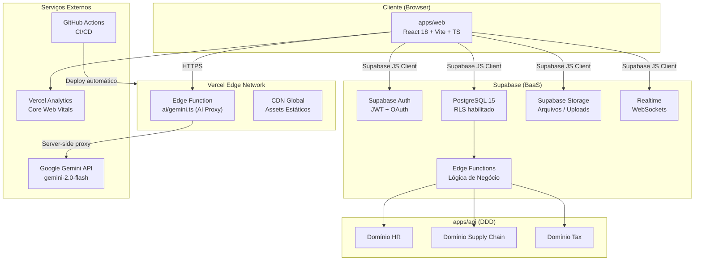

### Princípios Arquiteturais

| Princípio            | Implementação                                                 |
| -------------------- | ------------------------------------------------------------- |
| Clean Architecture   | Camadas: Presentation → Application → Domain → Infrastructure |
| Domain-Driven Design | Bounded contexts por domínio de negócio                       |
| Security First       | AI Proxy, RLS, RBAC, LGPD/GDPR                                |
| Privacy by Design    | Minimização de dados, consentimento granular                  |
| i18n Native          | PT-BR, EN-US, ES-ES desde o início                            |
| Demo Mode            | Funciona sem credenciais reais                                |

---

## Stack Tecnológica

### Frontend (apps/web)

| Categoria    | Tecnologia                   | Versão   | Papel                       |
| ------------ | ---------------------------- | -------- | --------------------------- |
| UI Framework | React                        | 18       | Biblioteca principal de UI  |
| Linguagem    | TypeScript                   | 5.x      | Type safety                 |
| Build Tool   | Vite                         | 5.x      | Bundler e dev server        |
| Estilização  | TailwindCSS                  | 3.x      | Utility-first CSS           |
| Componentes  | shadcn/ui + Radix UI         | latest   | Componentes acessíveis      |
| Ícones       | Lucide React                 | latest   | Ícones consistentes         |
| Gráficos     | Recharts                     | latest   | Visualizações de dados      |
| Server State | TanStack Query (React Query) | v5       | Cache e sincronização       |
| Roteamento   | React Router                 | v6       | SPA routing                 |
| i18n         | i18next + react-i18next      | latest   | Internacionalização         |
| Formulários  | React Hook Form              | latest   | Gestão de formulários       |
| Notificações | Sonner                       | latest   | Toast notifications         |
| Monorepo UI  | @superrelatorios/ui          | internal | Design system compartilhado |

### Backend / Infraestrutura

| Categoria      | Tecnologia                           | Papel                                  |
| -------------- | ------------------------------------ | -------------------------------------- |
| BaaS           | Supabase                             | PostgreSQL + Auth + Storage + Realtime |
| Banco de Dados | PostgreSQL 15                        | Persistência principal                 |
| Autenticação   | Supabase Auth                        | JWT + OAuth (Google)                   |
| Storage        | Supabase Storage                     | Uploads de arquivos                    |
| Edge Functions | Supabase Edge Functions              | Lógica serverless                      |
| AI Proxy       | Vercel Edge Function (api/gemini.ts) | Proxy seguro para Gemini               |
| IA             | Google Gemini 2.0 Flash              | Análises e recomendações               |
| Hosting        | Vercel                               | Frontend + Edge Functions              |
| CDN            | Vercel Edge Network                  | Assets estáticos globais               |
| Analytics      | Vercel Analytics                     | Core Web Vitals                        |
| CI/CD          | GitHub Actions                       | Pipeline automatizado                  |
| Monorepo       | Turborepo                            | Build orchestration                    |
| Git Hooks      | Husky + lint-staged                  | Qualidade pré-commit                   |

### Ferramentas de Qualidade

| Ferramenta          | Papel                |
| ------------------- | -------------------- |
| ESLint              | Linting de código    |
| Prettier            | Formatação           |
| TypeScript Compiler | Type checking        |
| Vitest              | Testes unitários     |
| Playwright          | Testes E2E           |
| Lighthouse CI       | Performance auditing |

---

## Estrutura do Monorepo

```
superrelatorios/                    # Raiz do monorepo (Turborepo)
├── apps/
│   ├── web/                        # Frontend React
│   │   └── src/
│   │       ├── components/         # Componentes React
│   │       │   ├── ui/             # Design system (shadcn/ui)
│   │       │   ├── radar/          # Componentes do Radar
│   │       │   ├── decision/       # Painel de Decisão
│   │       │   ├── indicators/     # Painel de Indicadores
│   │       │   ├── charts/         # Gráficos (Recharts)
│   │       │   ├── forms/          # Formulários
│   │       │   └── layout/         # Layout e navegação
│   │       ├── pages/              # Páginas (rotas)
│   │       │   ├── app/            # Rotas autenticadas
│   │       │   └── auth/           # Rotas de autenticação
│   │       ├── hooks/              # Custom hooks
│   │       ├── contexts/           # React contexts (Auth, Theme)
│   │       ├── lib/                # Utilitários e clientes
│   │       │   └── supabase.ts     # Cliente Supabase
│   │       ├── types/              # TypeScript types
│   │       ├── locales/            # Arquivos de tradução (i18n)
│   │       │   ├── pt-BR.json
│   │       │   ├── en-US.json
│   │       │   └── es-ES.json
│   │       └── styles/             # Estilos globais e tokens
│   └── api/                        # Backend DDD
│       └── src/
│           └── domain/
│               └── domain/
│                   ├── hr/         # Domínio Recursos Humanos
│                   ├── supply_chain/ # Domínio Cadeia de Suprimentos
│                   └── tax/        # Domínio Fiscal
├── api/
│   └── gemini.ts                   # AI Proxy (Vercel Edge Function)
├── docs/                           # Documentação estruturada
│   ├── 01-strategy/
│   ├── 02-technical/
│   ├── 03-operations/
│   ├── 04-api/
│   ├── 05-user-guides/
│   ├── 06-compliance/
│   └── 07-knowledge/
├── supabase/                       # Configurações Supabase
│   ├── migrations/                 # Migrações SQL
│   └── functions/                  # Edge Functions
├── .github/workflows/              # GitHub Actions
├── turbo.json                      # Configuração Turborepo
└── package.json                    # Workspace root
```

---

## Arquitetura do Frontend

### Roteamento

```
/                           → Landing page pública (SEO, i18n)
/:lang/                     → Raiz localizada (pt-BR, en-US, es-ES)
/:lang/auth/login           → Login
/:lang/auth/register        → Cadastro
/:lang/app                  → Dashboard principal (autenticado)
/:lang/app/metrics          → Painel de Indicadores
/:lang/app/decision-panel   → Painel de Decisão
/:lang/app/analytics        → Analytics Avançados
/:lang/app/consolidated     → Dashboard Consolidado
/:lang/app/radar            → Radar de Alertas
/:lang/app/action-plan      → Plano de Ação
/:lang/app/risks            → Gestão de Riscos
/:lang/app/reports          → Relatórios
/:lang/app/settings         → Configurações
```

### Gerenciamento de Estado

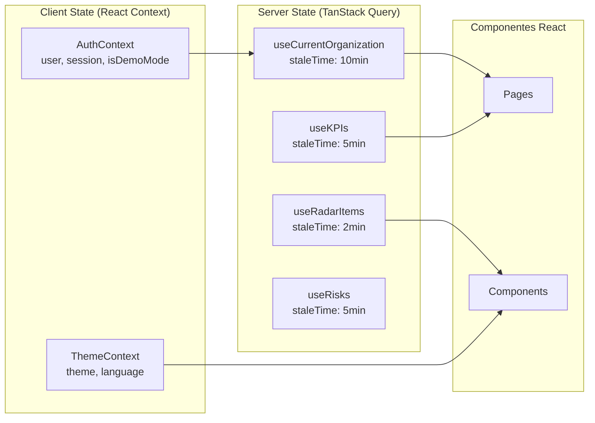

### Padrões de Componentes

- **Atomic Design**: Átomos (ui/) → Moléculas (indicators/) → Organismos (radar/, decision/) → Templates (layout/) → Páginas (pages/)
- **Container/Presentation**: Hooks encapsulam lógica; componentes são puros
- **Custom Hooks**: Toda lógica de negócio em hooks (`useCurrentOrganization`, `useRadarItems`, `useUpdateRadarItemStatus`)
- **i18n First**: Nenhuma string hard-coded — todas via `useTranslation()` do i18next

### Hooks Principais

| Hook                       | Responsabilidade                | Cache    |
| -------------------------- | ------------------------------- | -------- |
| `useCurrentOrganization`   | Organização ativa do usuário    | 10 min   |
| `useAuth`                  | Sessão, user, isDemoMode        | Realtime |
| `useKPIs`                  | KPIs da organização por período | 5 min    |
| `useRadarItems`            | Alertas do radar                | 2 min    |
| `useUpdateRadarItemStatus` | Mutação de status do radar      | —        |
| `useRisks`                 | Riscos da organização           | 5 min    |
| `useReports`               | Relatórios e pastas             | 5 min    |

### Demo Mode

Quando `VITE_SUPABASE_URL` ou `VITE_SUPABASE_ANON_KEY` não estão configuradas, o sistema entra em Demo Mode automaticamente:

- `AuthContext` retorna `isDemoMode: true` e `user.id = "demo-user-id"`
- `useCurrentOrganization` retorna organização fictícia `{ id: "demo-org-id", name: "Empresa Demo" }` sem chamadas ao banco
- Todos os hooks retornam dados mock representativos
- Banner informativo é exibido em todas as telas autenticadas

---

## Arquitetura da API e Domínios DDD

### Clean Architecture — Camadas

```
┌──────────────────────────────────────────────┐
│  PRESENTATION LAYER                          │
│  React Components, Pages, Hooks              │
└──────────────────────────────────────────────┘
                    ↓ depende de
┌──────────────────────────────────────────────┐
│  APPLICATION LAYER                           │
│  Use Cases, Application Services, DTOs       │
│  Ex: GetUnifiedMetricsUseCase                │
│      DetectChallengesUseCase                 │
│      StrategyApplicationService              │
└──────────────────────────────────────────────┘
                    ↓ depende de
┌──────────────────────────────────────────────┐
│  DOMAIN LAYER (núcleo — sem dependências)    │
│  Entities, Value Objects, Domain Services    │
│  Ex: UnifiedMetricsEntity                   │
│      KPIValue (Value Object)                 │
│      Threshold (Value Object)                │
│      MetricsCalculationService               │
└──────────────────────────────────────────────┘
                    ↓ implementado por
┌──────────────────────────────────────────────┐
│  INFRASTRUCTURE LAYER                        │
│  Repositories (Supabase), External APIs      │
│  Ex: SupabaseMetricsRepository               │
│      SupabaseChallengeRepository             │
└──────────────────────────────────────────────┘
```

### Domínios de Negócio (apps/api)

#### Domínio HR (Recursos Humanos)

KPIs suportados: produtividade por funcionário, turnover, satisfação de equipe, custo por contratação.

#### Domínio Supply Chain (Cadeia de Suprimentos)

KPIs suportados: giro de estoque, prazo de entrega, taxa de ruptura, custo de armazenagem.

#### Domínio Tax (Fiscal)

KPIs suportados: carga tributária efetiva, compliance fiscal, provisões tributárias.

Todos os domínios seguem a mesma estrutura:

```
domain/{nome}/
├── entities/           # Entidades do domínio
├── value-objects/      # Value objects imutáveis
├── services/           # Domain services
├── repositories/       # Interfaces de repositório
└── use-cases/          # Casos de uso da aplicação
```

### Motor Estratégico

O Motor Estratégico é o componente central de inteligência da plataforma:

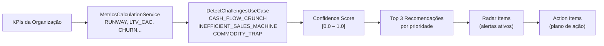

### AI Proxy (api/gemini.ts)

Edge Function Vercel que atua como proxy seguro para o Google Gemini API:

- Chave `GEMINI_API_KEY` nunca exposta ao browser
- Rate limiting por IP: 20 req/min (in-memory, Redis em produção)
- Validação de origem via `ALLOWED_ORIGIN`
- CORS configurado para aceitar apenas origens autorizadas
- Runtime: `edge` (Vercel Edge Runtime)

---

## Modelo de Dados

### Diagrama ER Principal

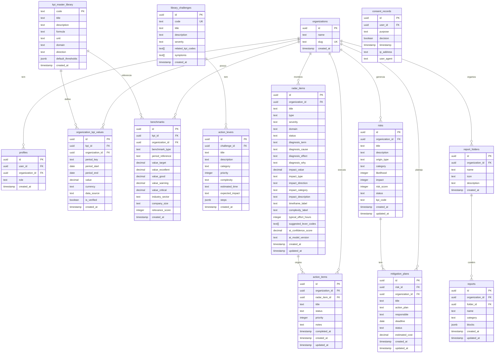

### Políticas RLS (Row Level Security)

Todas as tabelas com dados de organização possuem políticas RLS que garantem isolamento total:

```sql
-- Padrão aplicado a todas as tabelas com organization_id
CREATE POLICY "org_isolation" ON {tabela}
  USING (organization_id = (
    SELECT organization_id FROM profiles
    WHERE user_id = auth.uid()
  ));
```

### Invariantes do Modelo de Dados

- `kpi_master_library`: `threshold.critical < threshold.warning < threshold.good`
- `benchmarks`: `value_critical < value_warning < value_good < value_excellent`
- `risks`: `risk_score = likelihood * impact` (1 ≤ likelihood ≤ 10, 1 ≤ impact ≤ 10)
- `action_items`: `radar_item_id` deve referenciar um `radar_items.id` existente
- `radar_items`: `ai_confidence_score ∈ [0.0, 1.0]`

---

## Fluxos de Dados Principais

### 1. Fluxo de Autenticação

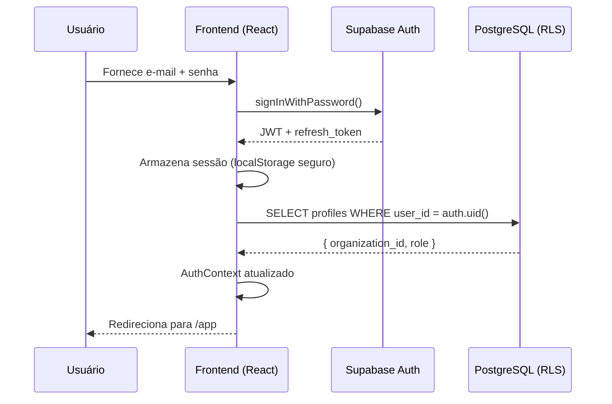

### 2. Fluxo de KPIs e Dashboard

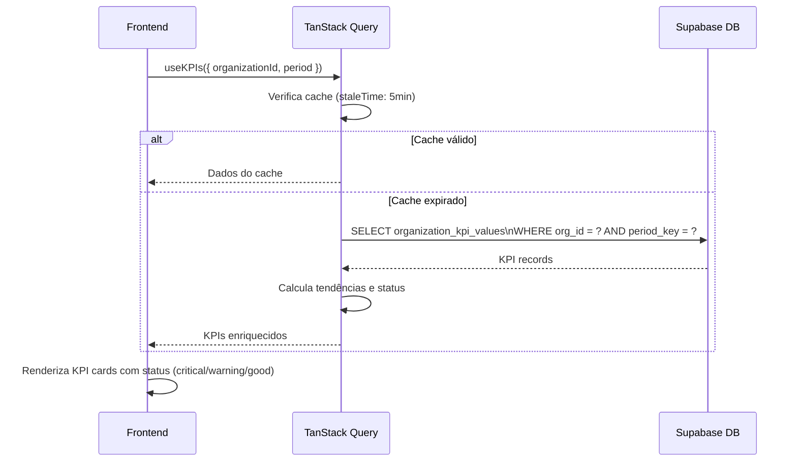

### 3. Fluxo do Radar de Alertas

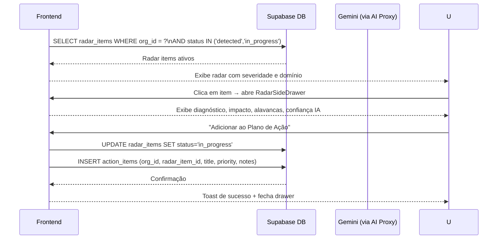

### 4. Fluxo de Geração de Relatório com IA

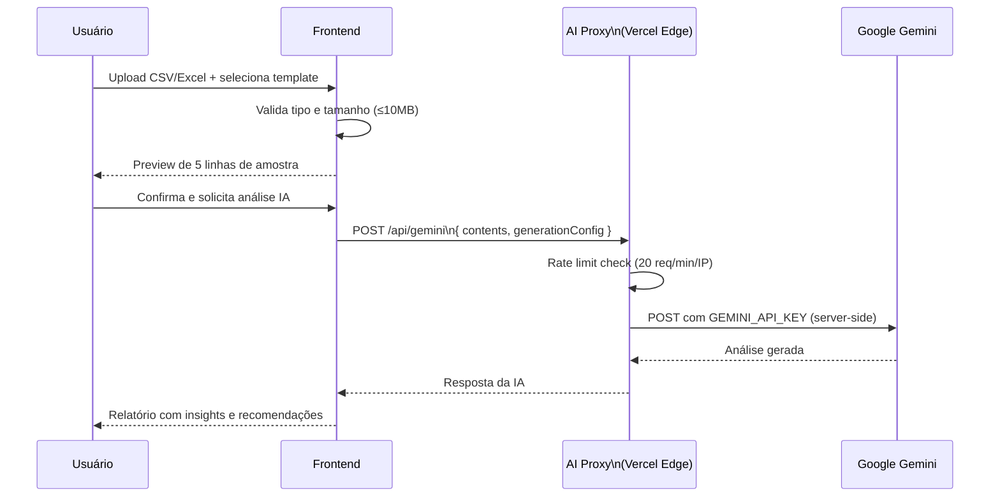

---

## Segurança

### Modelo de Segurança em Camadas

```
┌─────────────────────────────────────────────────────┐
│  CAMADA 1: Edge / CDN (Vercel)                      │
│  • HTTPS/TLS obrigatório                            │
│  • Security headers (CSP, HSTS, X-Frame-Options)   │
│  • CORS restrito a origens autorizadas              │
└─────────────────────────────────────────────────────┘
┌─────────────────────────────────────────────────────┐
│  CAMADA 2: Autenticação (Supabase Auth)             │
│  • JWT com expiração configurável                   │
│  • Refresh token automático                         │
│  • OAuth Google como provedor externo               │
│  • Bloqueio temporário após N falhas consecutivas   │
└─────────────────────────────────────────────────────┘
┌─────────────────────────────────────────────────────┐
│  CAMADA 3: Autorização (RBAC)                       │
│  • 4 papéis: admin > manager > analyst > viewer     │
│  • Verificação em cada requisição à API             │
│  • HTTP 403 para acessos não autorizados            │
└─────────────────────────────────────────────────────┘
┌─────────────────────────────────────────────────────┐
│  CAMADA 4: Banco de Dados (RLS)                     │
│  • Row Level Security em todas as tabelas           │
│  • Isolamento total entre organizações              │
│  • Políticas baseadas em auth.uid()                 │
└─────────────────────────────────────────────────────┘
┌─────────────────────────────────────────────────────┐
│  CAMADA 5: AI Proxy                                 │
│  • GEMINI_API_KEY nunca exposta ao browser          │
│  • Rate limiting por IP (20 req/min)                │
│  • Validação de origem e payload                    │
└─────────────────────────────────────────────────────┘
```

### RBAC — Hierarquia de Permissões

| Papel     | Permissões                                       |
| --------- | ------------------------------------------------ |
| `viewer`  | Visualizar dashboards e relatórios               |
| `analyst` | viewer + criar/editar relatórios e KPIs          |
| `manager` | analyst + gerenciar dados do departamento        |
| `admin`   | Acesso total: usuários, configurações, auditoria |

### LGPD / GDPR

- Detecção automática de PII (CPF, CNPJ, e-mail, telefone, cartão)
- Criptografia AES-256 para PII em repouso
- HTTPS/TLS para dados em trânsito
- Consentimento granular por finalidade
- Direito de portabilidade e esquecimento (LGPD Art. 18)
- Retenção: dados de usuário 7 anos, analytics 2 anos, consentimento 1 ano, logs 3 anos
- Rotação automática de chaves a cada 90 dias

### Rate Limiting

| Contexto               | Limite          | Janela     |
| ---------------------- | --------------- | ---------- |
| API pública (Standard) | 1.000 req       | 1 hora     |
| API pública (Premium)  | 10.000 req      | 1 hora     |
| AI Proxy               | 20 req/IP       | 1 minuto   |
| Autenticação geral     | 100 req/cliente | 15 minutos |

---

## Performance e Caching

### Estratégia de Cache Multi-Camada

```
Browser Cache (1 ano)
    └── Assets estáticos (JS, CSS, imagens) via Vercel CDN

TanStack Query Cache (in-memory)
    ├── Dados de organização: staleTime 10 min, gcTime 30 min
    ├── KPIs: staleTime 5 min
    ├── Radar items: staleTime 2 min
    └── Relatórios: staleTime 5 min

Supabase Connection Pool
    └── PostgreSQL com pool de conexões por ambiente
        ├── Dev: 5 conexões
        ├── Staging: 10 conexões
        └── Production: 20 conexões
```

### Metas de Performance (Core Web Vitals)

| Métrica                        | Meta                                     |
| ------------------------------ | ---------------------------------------- |
| First Contentful Paint (FCP)   | < 1.8s                                   |
| Largest Contentful Paint (LCP) | < 2.5s                                   |
| Time to Interactive (TTI)      | < 3.0s                                   |
| Cumulative Layout Shift (CLS)  | < 0.1                                    |
| API Response Time (p95)        | < 200ms                                  |
| Uptime                         | > 99.9%                                  |
| Lighthouse Score               | > 90 (Performance, A11y, Best Practices) |

### Otimizações de Bundle

- Code splitting por rota (React.lazy + Suspense)
- Lazy loading para componentes pesados (gráficos Recharts)
- Bundle inicial alvo: < 600KB gzipped
- Tree shaking via Vite
- Prefetching inteligente de rotas adjacentes
- CDN global Vercel para assets estáticos

### Índices de Banco de Dados

Índices compostos críticos para performance:

```sql
-- KPIs por organização e período (query mais frequente)
CREATE INDEX idx_org_kpi_period
  ON organization_kpi_values(organization_id, kpi_code, period_key);

-- Radar items ativos por organização
CREATE INDEX idx_radar_active
  ON radar_items(organization_id, status)
  WHERE status IN ('detected', 'in_progress');

-- Riscos por organização e status
CREATE INDEX idx_risks_org_status
  ON risks(organization_id, status, risk_score DESC);
```

---

## CI/CD e Infraestrutura

### Pipeline GitHub Actions

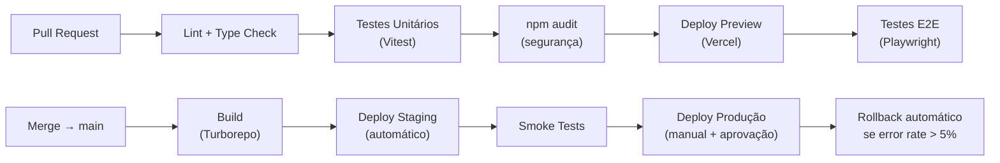

### Ambientes

| Ambiente    | Branch     | Trigger            | URL                         |
| ----------- | ---------- | ------------------ | --------------------------- |
| Development | develop    | Push automático    | dev.superrelatorios.com     |
| Staging     | main       | Merge automático   | staging.superrelatorios.com |
| Production  | main (tag) | Manual + aprovação | superrelatorios.com         |

### Quality Gates (bloqueiam merge)

1. ESLint sem erros
2. TypeScript sem erros de tipo
3. Testes unitários passando (cobertura > 80% em hooks/serviços críticos)
4. `npm audit` sem vulnerabilidades high/critical
5. Build bem-sucedido

### Husky Pre-commit

```
pre-commit → lint-staged
    ├── *.ts, *.tsx → eslint --fix + prettier
    └── *.json → prettier
```

### Conventional Commits

Formato obrigatório: `type(scope): description`

- `feat`: nova funcionalidade
- `fix`: correção de bug
- `docs`: documentação
- `refactor`: refatoração sem mudança de comportamento
- `test`: adição/correção de testes
- `chore`: tarefas de manutenção

---

## Decisões Arquiteturais (ADRs)

### ADR-001: Supabase como BaaS

**Decisão**: Usar Supabase (PostgreSQL + Auth + Storage + Edge Functions) como backend principal.

**Justificativa**: Setup rápido, RLS nativo, Auth completo com OAuth, Storage integrado, Realtime via WebSockets, custo previsível. Elimina necessidade de gerenciar infraestrutura de banco de dados.

**Trade-offs**: Vendor lock-in parcial; mitigado pela portabilidade do PostgreSQL padrão.

---

### ADR-002: AI Proxy via Vercel Edge Function

**Decisão**: Toda comunicação com o Google Gemini API é mediada por uma Edge Function (`api/gemini.ts`), nunca diretamente do browser.

**Justificativa**: A chave `GEMINI_API_KEY` nunca é exposta ao cliente. Rate limiting e validação de origem são aplicados na borda. Segurança por design.

**Trade-offs**: Latência adicional de ~10-30ms; aceitável dado o ganho de segurança.

---

### ADR-003: TanStack Query para Server State

**Decisão**: Usar TanStack Query (React Query v5) para todo estado de servidor; React Context apenas para estado de cliente (auth, tema).

**Justificativa**: Cache inteligente com staleTime configurável, deduplicação de requests, retry automático, DevTools excelentes. Elimina boilerplate de Redux/Zustand para dados remotos.

**Trade-offs**: Curva de aprendizado para invalidação de cache; mitigado por query keys bem definidas.

---

### ADR-004: Monorepo com Turborepo

**Decisão**: Organizar frontend e API em monorepo gerenciado pelo Turborepo.

**Justificativa**: Compartilhamento de tipos TypeScript entre apps, build incremental com cache, pipeline de CI unificado, design system compartilhado (`@superrelatorios/ui`).

**Trade-offs**: Complexidade inicial de setup; compensada pela consistência a longo prazo.

---

### ADR-005: i18n First com i18next

**Decisão**: Nenhuma string hard-coded nos componentes. Todas as strings via `useTranslation()` do i18next com suporte a PT-BR, EN-US e ES-ES.

**Justificativa**: Expansão global planejada. Custo de retrofit de i18n é muito maior que implementar desde o início.

**Trade-offs**: Overhead de manutenção dos arquivos de tradução; mitigado por tooling de extração automática.

---

### ADR-006: Demo Mode sem Credenciais

**Decisão**: A aplicação funciona em modo demo completo quando variáveis de ambiente Supabase não estão configuradas.

**Justificativa**: Reduz fricção para avaliação do produto. Potenciais clientes podem explorar todas as funcionalidades sem setup.

**Trade-offs**: Manutenção de dados mock representativos; necessário atualizar junto com novas features.

---

### ADR-007: RBAC com 4 Papéis

**Decisão**: Hierarquia de 4 papéis: `admin > manager > analyst > viewer`.

**Justificativa**: Cobre os casos de uso de PMEs sem complexidade excessiva. Permissões verificadas em cada requisição à API (não apenas no carregamento da UI).

**Trade-offs**: Papéis fixos podem não cobrir todos os casos enterprise; extensível via permissões granulares futuras.

---

## Propriedades de Corretude

_Uma propriedade é uma característica ou comportamento que deve ser verdadeiro em todas as execuções válidas de um sistema — essencialmente, uma declaração formal sobre o que o sistema deve fazer. Propriedades servem como ponte entre especificações legíveis por humanos e garantias de corretude verificáveis por máquinas._

---

### Property 1: Autenticação retorna JWT para credenciais válidas

_Para qualquer_ par de credenciais válidas (e-mail + senha registrados), o sistema deve retornar um token JWT válido e iniciar uma sessão. Para qualquer par de credenciais inválidas, o sistema deve retornar um erro que não revela qual campo está incorreto.

**Validates: Requirements 1.1, 1.2**

---

### Property 2: Bloqueio após falhas consecutivas de login

_Para qualquer_ conta de usuário, após N tentativas de login consecutivas com falha, a próxima tentativa deve ser bloqueada com resposta de erro de bloqueio temporário, independentemente das credenciais fornecidas.

**Validates: Requirements 1.7**

---

### Property 3: Isolamento de dados entre organizações (RLS)

_Para qualquer_ par de organizações distintas A e B, uma query executada no contexto da organização A nunca deve retornar registros pertencentes à organização B, para qualquer tabela com `organization_id`.

**Validates: Requirements 2.6**

---

### Property 4: Controle de acesso retorna 403 para recursos não autorizados

_Para qualquer_ usuário e qualquer recurso para o qual esse usuário não possui permissão suficiente (baseado em seu papel RBAC), a API deve retornar HTTP 403 com mensagem padronizada.

**Validates: Requirements 3.6**

---

### Property 5: Invariante de ordenação de thresholds

_Para qualquer_ KPI na biblioteca e qualquer benchmark no sistema, os valores de threshold devem respeitar a ordenação: `critical < warning < good` (KPIs) e `value_critical < value_warning < value_good < value_excellent` (benchmarks).

**Validates: Requirements 4.3, 6.9**

---

### Property 6: Round-trip de serialização de KPI

_Para qualquer_ objeto KPI válido da biblioteca, serializar para JSON e depois deserializar deve produzir um objeto equivalente ao original (mesmos campos e valores).

**Validates: Requirements 4.10**

---

### Property 7: Filtro de KPIs por período é subconjunto do total (metamórfica)

_Para qualquer_ conjunto de registros de KPI de uma organização e qualquer `period_key` válido, o resultado de filtrar por esse `period_key` deve ser um subconjunto do conjunto total de registros da organização.

**Validates: Requirements 5.7**

---

### Property 8: Cálculo correto do gap_percentage de benchmark

_Para qualquer_ par de valores `actual` e `target` (com `target ≠ 0`), o `gap_percentage` calculado deve ser igual a `((actual - target) / target) * 100`, com precisão de 2 casas decimais.

**Validates: Requirements 6.5**

---

### Property 9: Corretude das fórmulas do Motor de Cálculo de KPIs

_Para qualquer_ conjunto de inputs válidos, o Motor Estratégico deve calcular cada KPI derivado de acordo com sua fórmula definida:

- `RUNWAY = saldo_caixa / burn_rate` (1 decimal)
- `LTV_CAC_RATIO = ltv / cac` (2 decimais)
- `CHURN_RATE = (clientes_perdidos / total_clientes) * 100` (2 decimais)
- `NET_PROFIT_MARGIN = (lucro_liquido / receita) * 100` (2 decimais)
- `CONTRIBUTION_MARGIN = ((receita - custos_variaveis) / receita) * 100` (2 decimais)

Para inputs inválidos (denominador zero ou negativo), o Motor deve retornar erro descritivo sem realizar a divisão.

**Validates: Requirements 7.1, 7.2, 7.3, 7.4, 7.5, 7.6, 7.7, 7.8, 7.9**

---

### Property 10: Determinismo dos cálculos de KPI

_Para qualquer_ conjunto de inputs, chamar qualquer função de cálculo de KPI duas vezes com os mesmos inputs deve produzir exatamente o mesmo resultado (sem efeitos colaterais, sem aleatoriedade).

**Validates: Requirements 7.10**

---

### Property 11: Model-based testing dos cálculos de KPI

_Para qualquer_ conjunto de inputs válidos, o resultado do Motor de Cálculo deve ser equivalente ao resultado de uma implementação de referência simples (cálculo direto em Python/JS sem otimizações).

**Validates: Requirements 7.11**

---

### Property 12: Confidence score sempre em [0.0, 1.0]

_Para qualquer_ conjunto de KPIs de entrada, o `confidence_score` calculado para qualquer desafio detectado deve estar sempre no intervalo fechado [0.0, 1.0].

**Validates: Requirements 8.4, 8.7**

---

### Property 13: Idempotência da detecção de desafios

_Para qualquer_ conjunto de dados de KPIs, executar o algoritmo de detecção de desafios duas vezes consecutivas com os mesmos dados deve produzir exatamente o mesmo conjunto de desafios detectados (mesmos códigos, severidades e confidence scores).

**Validates: Requirements 8.8**

---

### Property 14: Invariante de cálculo do risk_score

_Para qualquer_ risco com `likelihood` e `impact` definidos, o campo `risk_score` deve ser sempre igual a `likelihood * impact`.

**Validates: Requirements 10.2, 10.9**

---

### Property 15: Idempotência de dispensa de Radar Item

_Para qualquer_ Radar Item com status `dismissed`, executar a operação de dispensa novamente deve deixar o item no mesmo estado `dismissed` sem alterar outros campos.

**Validates: Requirements 12.10**

---

### Property 16: Integridade referencial de Action Items

_Para qualquer_ Action Item criado no sistema, seu campo `radar_item_id` deve referenciar um Radar Item existente na tabela `radar_items`.

**Validates: Requirements 13.5**

---

### Property 17: Round-trip de i18n

_Para qualquer_ chave de tradução e qualquer idioma suportado (PT-BR, EN-US, ES-ES), mudar o idioma ativo para outro idioma e depois voltar ao idioma original deve produzir exatamente a mesma string de tradução para aquela chave.

**Validates: Requirements 16.9**

---

### Property 18: Rate limiting retorna 429 após limite excedido

_Para qualquer_ cliente (identificado por IP + User-Agent), após enviar 100 requisições dentro de uma janela de 15 minutos, a próxima requisição deve receber HTTP 429 com header `Retry-After`.

**Validates: Requirements 17.1**

---

### Property 19: Round-trip de recursos da API

_Para qualquer_ tipo de recurso da API (KPI, risco, benchmark, relatório), criar um recurso via POST e depois buscá-lo via GET pelo mesmo ID deve retornar dados equivalentes ao que foi enviado na criação.

**Validates: Requirements 21.8**

---

### Property 20: Invariante de formato de erro da API

_Para qualquer_ resposta de erro da API (4xx ou 5xx), o campo `error.code` deve estar sempre presente no corpo da resposta JSON.

**Validates: Requirements 21.9**

---

## Tratamento de Erros

### Formato Padrão de Erro da API

```json
{
  "error": {
    "code": "VALIDATION_ERROR",
    "message": "Descrição legível do erro",
    "details": {
      "field": "nome_do_campo",
      "invalid_value": "valor_inválido"
    }
  }
}
```

### Códigos de Erro HTTP

| Código | Situação                                               |
| ------ | ------------------------------------------------------ |
| 400    | Payload inválido ou campos obrigatórios ausentes       |
| 401    | Token JWT ausente, expirado ou com assinatura inválida |
| 403    | Permissão insuficiente para o recurso (RBAC)           |
| 404    | Recurso não encontrado                                 |
| 429    | Rate limit excedido (inclui `Retry-After`)             |
| 500    | Erro interno do servidor                               |
| 502    | Falha ao alcançar serviço upstream (ex: Gemini)        |
| 503    | Serviço não configurado (ex: GEMINI_API_KEY ausente)   |

### Estratégia de Retry no Frontend

TanStack Query aplica retry automático com backoff exponencial:

- 3 tentativas para erros de rede (5xx)
- Sem retry para erros de cliente (4xx)
- `staleTime` evita refetch desnecessário

### Error Boundaries

Componentes React envolvidos em Error Boundaries granulares:

- Nível de página: captura erros de renderização e exibe fallback
- Nível de widget: KPI cards e gráficos têm fallback individual
- Nível global: captura erros não tratados e reporta ao Sentry

### Modo Demo — Silenciamento de Erros

Em Demo Mode, avisos de console relacionados a variáveis de ambiente opcionais não configuradas são silenciados para não poluir o console do usuário final.

---

## Estratégia de Testes

### Abordagem Dual: Testes Unitários + Property-Based Testing

Testes unitários e property-based tests são complementares e ambos são necessários:

- **Testes unitários**: verificam exemplos específicos, casos de borda e condições de erro
- **Property-based tests**: verificam propriedades universais em um grande espaço de inputs gerados aleatoriamente

### Testes Unitários

Foco em:

- Exemplos concretos de comportamento correto
- Casos de borda documentados (ex: burn_rate = 0, organização não encontrada)
- Pontos de integração entre componentes
- Fluxos de autenticação e autorização

Ferramentas:

- **Vitest** para testes unitários e de integração (frontend e API)
- **React Testing Library** para testes de componentes
- **Playwright** para testes E2E dos fluxos críticos: autenticação, criação de KPI, geração de relatório

Meta de cobertura: > 80% para hooks e serviços críticos.

### Property-Based Testing

Biblioteca recomendada: **fast-check** (TypeScript/JavaScript)

Configuração mínima: **100 iterações por propriedade** (devido à aleatoriedade dos inputs gerados).

Cada teste de propriedade deve referenciar a propriedade do design com o seguinte formato de tag:

```
// Feature: project-spec-documentation, Property N: <texto da propriedade>
```

#### Mapeamento Propriedade → Teste

| Propriedade                  | Tipo     | Geradores fast-check                                                         |
| ---------------------------- | -------- | ---------------------------------------------------------------------------- |
| P1: Autenticação             | property | `fc.emailAddress()`, `fc.string()`                                           |
| P2: Bloqueio por falhas      | property | `fc.integer({ min: 1, max: 20 })`                                            |
| P3: Isolamento RLS           | property | `fc.uuid()` (dois org IDs distintos)                                         |
| P4: RBAC 403                 | property | `fc.constantFrom('viewer','analyst','manager','admin')`                      |
| P5: Threshold ordering       | property | `fc.record({ critical: fc.float(), warning: fc.float(), good: fc.float() })` |
| P6: Round-trip KPI           | property | `fc.record(...)` com campos de KPI                                           |
| P7: Filtro metamórfico       | property | `fc.array(fc.record(...))` de KPI records                                    |
| P8: gap_percentage           | property | `fc.float()` para actual e target                                            |
| P9: Fórmulas KPI             | property | `fc.float({ min: 0.01 })` para inputs válidos                                |
| P10: Determinismo            | property | Qualquer input válido, chamado 2x                                            |
| P11: Model-based             | property | Comparação com implementação de referência                                   |
| P12: Confidence [0,1]        | property | `fc.array(fc.record(...))` de KPI values                                     |
| P13: Idempotência detecção   | property | Qualquer dataset de KPIs                                                     |
| P14: risk_score invariante   | property | `fc.integer({ min: 1, max: 10 })` para likelihood e impact                   |
| P15: Idempotência dispensa   | property | `fc.record(...)` de RadarItem com status dismissed                           |
| P16: Integridade referencial | property | `fc.uuid()` para radar_item_id                                               |
| P17: Round-trip i18n         | property | `fc.constantFrom('pt-BR','en-US','es-ES')`                                   |
| P18: Rate limiting 429       | property | `fc.integer({ min: 101, max: 200 })` requests                                |
| P19: Round-trip API          | property | `fc.record(...)` para cada tipo de recurso                                   |
| P20: error.code presente     | property | Qualquer input que gere erro 4xx/5xx                                         |

#### Exemplo de Teste de Propriedade

```typescript
import fc from "fast-check";
import { MetricsCalculationService } from "../domain/metrics/services/MetricsCalculationService";

const service = new MetricsCalculationService();

// Feature: project-spec-documentation, Property 9: Corretude das fórmulas do Motor de Cálculo de KPIs
test("RUNWAY calculation is correct for all valid inputs", () => {
  fc.assert(
    fc.property(
      fc.float({ min: 0.01, max: 1_000_000 }), // cashBalance
      fc.float({ min: 0.01, max: 1_000_000 }), // burnRate
      (cashBalance, burnRate) => {
        const result = service.calculateRunway(cashBalance, burnRate);
        expect(result.isSuccess).toBe(true);
        const expected = Math.round((cashBalance / burnRate) * 10) / 10;
        expect(result.getValue()).toBe(expected);
      },
    ),
    { numRuns: 100 },
  );
});

// Feature: project-spec-documentation, Property 9: edge-case — burn_rate zero ou negativo
test("RUNWAY returns error for zero or negative burn rate", () => {
  fc.assert(
    fc.property(
      fc.float({ min: 0 }), // cashBalance >= 0
      fc.float({ max: 0 }), // burnRate <= 0
      (cashBalance, burnRate) => {
        const result = service.calculateRunway(cashBalance, burnRate);
        expect(result.isFailure).toBe(true);
        expect(result.error).toBeTruthy();
      },
    ),
    { numRuns: 100 },
  );
});

// Feature: project-spec-documentation, Property 14: Invariante de cálculo do risk_score
test("risk_score always equals likelihood * impact", () => {
  fc.assert(
    fc.property(
      fc.integer({ min: 1, max: 10 }), // likelihood
      fc.integer({ min: 1, max: 10 }), // impact
      (likelihood, impact) => {
        const risk = createRisk({ likelihood, impact });
        expect(risk.risk_score).toBe(likelihood * impact);
      },
    ),
    { numRuns: 100 },
  );
});
```

### Testes E2E (Playwright)

Fluxos críticos cobertos:

1. Autenticação completa (login → dashboard → logout)
2. Criação e consulta de KPI
3. Interação com Radar (visualizar → adicionar ao plano → dispensar)
4. Geração de relatório com upload de CSV
5. Troca de idioma (PT-BR → EN-US → ES-ES)

### Testes de Performance

- Lighthouse CI em cada PR (score mínimo 90)
- Verificação de bundle size (máximo 600KB gzipped)
- Teste de carga da API com k6 (100 req/s por 60s)

---

## Novos Domínios: Document Pipeline, Data Sources, Knowledge Base e Company Blueprint

### Diagrama de Arquitetura Expandido

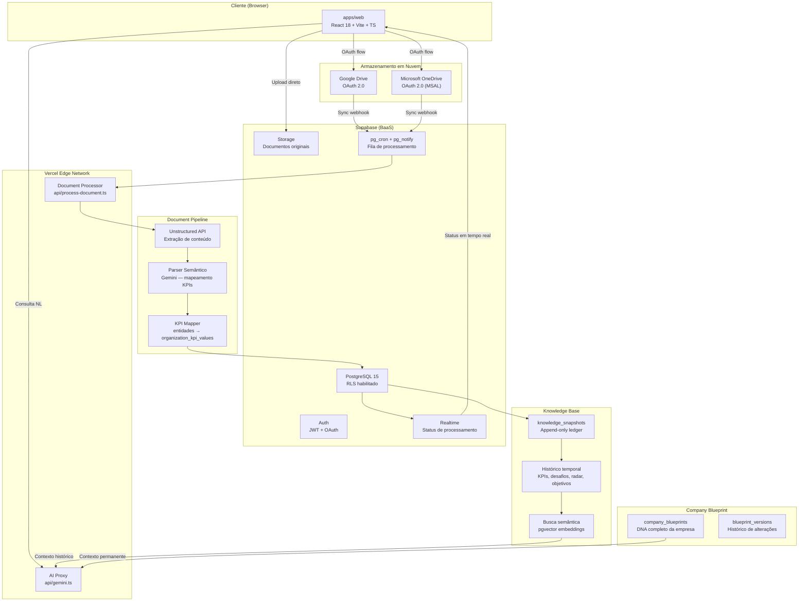

---

### Modelo de Dados Expandido

#### Novas Tabelas — Document Pipeline e Data Sources

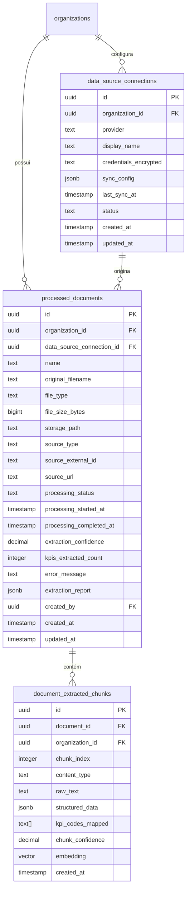

#### Novas Tabelas — Knowledge Base

```mermaid
erDiagram
    knowledge_snapshots {
        uuid id PK
        uuid organization_id FK
        text period_key UK_per_org
        date period_start
        date period_end
        text snapshot_type
        jsonb kpi_summary
        jsonb challenges_detected
        jsonb radar_items_active
        jsonb objectives_status
        jsonb action_plans_status
        text overall_health
        text ai_narrative
        timestamp created_at
    }

    kpi_history {
        uuid id PK
        uuid organization_id FK
        text kpi_code
        text period_key
        decimal value
        text data_source
        uuid source_document_id FK
        boolean is_verified
        uuid verified_by FK
        timestamp recorded_at
    }

    challenge_history {
        uuid id PK
        uuid organization_id FK
        text challenge_code
        text severity
        decimal confidence_score
        text status
        timestamp detected_at
        timestamp resolved_at
        jsonb kpis_snapshot
    }

    radar_item_history {
        uuid id PK
        uuid organization_id FK
        uuid radar_item_id FK
        text previous_status
        text new_status
        text changed_by_user_id
        text change_reason
        timestamp changed_at
    }

    knowledge_embeddings {
        uuid id PK
        uuid organization_id FK
        uuid snapshot_id FK
        text content_type
        text content_text
        vector embedding
        timestamp created_at
    }

    organizations ||--o{ knowledge_snapshots : "acumula"
    organizations ||--o{ kpi_history : "registra"
    organizations ||--o{ challenge_history : "rastreia"
    organizations ||--o{ radar_item_history : "audita"
    knowledge_snapshots ||--o{ knowledge_embeddings : "indexa"
```

#### Novas Tabelas — Company Blueprint

```mermaid
erDiagram
    company_blueprints {
        uuid id PK
        uuid organization_id UK
        text legal_name
        text trade_name
        text cnpj_encrypted
        integer founding_year
        text company_stage
        text business_model
        text value_proposition
        text mission
        text vision
        text[] core_values
        text industry_sector
        text industry_subsector
        text target_market
        text geographic_coverage
        text[] main_competitors
        text[] competitive_advantages
        text market_position
        text employee_count_range
        text annual_revenue_range
        text[] departments
        text[] key_processes
        text[] technology_stack
        integer operational_maturity
        jsonb products_services
        text[] main_revenue_streams
        text pricing_model
        decimal average_ticket
        jsonb strategic_objectives
        text[] current_priorities
        text[] known_challenges
        decimal growth_target_yoy
        text funding_stage
        boolean has_external_investors
        integer fiscal_year_start_month
        text reporting_currency
        decimal completeness_score
        timestamp created_at
        timestamp updated_at
    }

    blueprint_versions {
        uuid id PK
        uuid blueprint_id FK
        uuid organization_id FK
        jsonb snapshot_data
        jsonb diff
        uuid changed_by FK
        text change_reason
        timestamp changed_at
    }

    organizations ||--|| company_blueprints : "tem exatamente um"
    company_blueprints ||--o{ blueprint_versions : "versiona"
```

#### Atualização da tabela `organization_kpi_values`

A tabela existente recebe dois novos campos para suportar rastreabilidade de documentos:

```sql
ALTER TABLE organization_kpi_values
  ADD COLUMN source_document_id uuid REFERENCES processed_documents(id) ON DELETE SET NULL,
  ADD COLUMN source_chunk_id uuid REFERENCES document_extracted_chunks(id) ON DELETE SET NULL;

-- data_source recebe novo valor permitido
-- 'document_import' adicionado ao CHECK constraint existente
```

---

### Fluxo de Dados: Document Pipeline

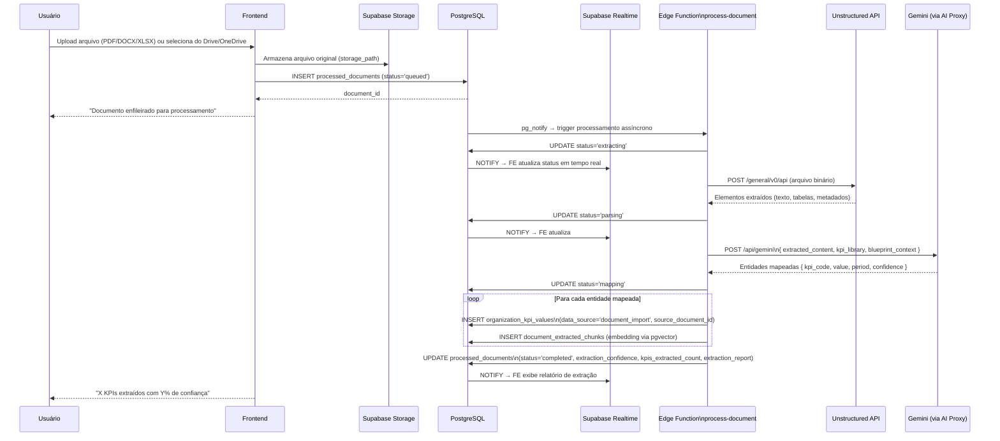

---

### Fluxo de Dados: Knowledge Base — Snapshot Periódico

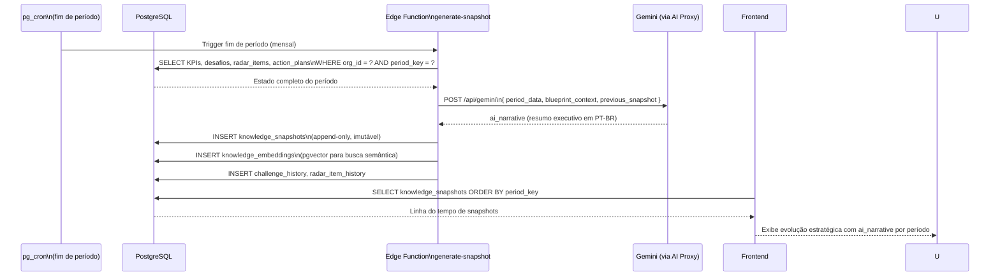

---

### Fluxo de Dados: Knowledge Base — Consulta em Linguagem Natural

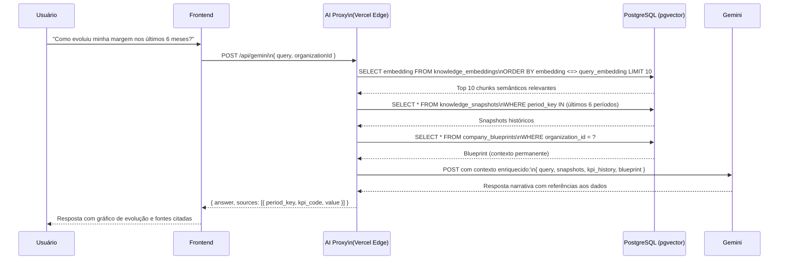

---

### Fluxo de Dados: Company Blueprint — Preenchimento via IA

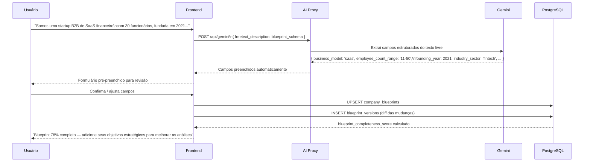

---

### Arquitetura do Document Pipeline — Componentes

#### Edge Function: `api/process-document.ts`

```
process-document Edge Function
├── DocumentQueueConsumer       — consome eventos pg_notify
├── UnstructuredClient          — integração com Unstructured API
│   ├── extractContent()        — extrai texto, tabelas, metadados
│   └── normalizeElements()     — normaliza estrutura de elementos
├── SemanticParser              — parser semântico via Gemini
│   ├── buildExtractionPrompt() — monta prompt com KPI library + blueprint
│   ├── parseEntities()         — identifica entidades financeiras/operacionais
│   └── mapToKPIs()             — mapeia entidades para kpi_codes
├── KPIMapper                   — persiste valores extraídos
│   ├── validateMappings()      — valida valores antes de persistir
│   ├── createKPIValues()       — INSERT organization_kpi_values
│   └── createChunks()          — INSERT document_extracted_chunks + embeddings
└── ExtractionReporter          — gera relatório de extração
    ├── calculateConfidence()   — score médio ponderado
    └── buildReport()           — relatório JSON com campos extraídos/não reconhecidos
```

#### Edge Function: `api/generate-snapshot.ts`

```
generate-snapshot Edge Function
├── PeriodDataCollector         — coleta estado completo do período
│   ├── collectKPIs()           — KPIs calculados do período
│   ├── collectChallenges()     — desafios detectados
│   ├── collectRadarItems()     — radar items ativos/resolvidos
│   ├── collectObjectives()     — status dos objetivos
│   └── collectActionPlans()    — status dos planos de ação
├── NarrativeGenerator          — gera ai_narrative via Gemini
│   ├── buildSnapshotPrompt()   — monta prompt com dados do período + blueprint
│   └── generateNarrative()     — resumo executivo em linguagem natural
├── SnapshotPersister           — persiste snapshot (append-only)
│   ├── insertSnapshot()        — INSERT knowledge_snapshots
│   └── insertEmbeddings()      — INSERT knowledge_embeddings (pgvector)
└── HistoryRecorder             — registra histórico de entidades
    ├── recordChallengeHistory()
    └── recordRadarItemHistory()
```

---

### Novas Rotas do Frontend

```
/:lang/app/data-sources              → Gestão de Data Sources (conexões)
/:lang/app/data-sources/documents    → Histórico de documentos processados
/:lang/app/data-sources/connect      → Wizard de conexão (Drive/OneDrive/Upload)
/:lang/app/knowledge                 → Linha do tempo estratégica (Knowledge Base)
/:lang/app/knowledge/query           → Consulta em linguagem natural
/:lang/app/knowledge/:period_key     → Snapshot detalhado de um período
/:lang/app/blueprint                 → Company Blueprint (DNA da empresa)
/:lang/app/blueprint/edit            → Edição do Blueprint (wizard multi-step)
/:lang/app/blueprint/history         → Histórico de versões do Blueprint
```

---

### Novos Hooks do Frontend

| Hook                     | Responsabilidade                           | Cache         |
| ------------------------ | ------------------------------------------ | ------------- |
| `useDataSources`         | Conexões de data sources da organização    | 5 min         |
| `useProcessedDocuments`  | Histórico de documentos com filtros        | 2 min         |
| `useDocumentStatus`      | Status em tempo real via Supabase Realtime | Realtime      |
| `useKnowledgeSnapshots`  | Lista de snapshots ordenados por período   | 10 min        |
| `useKnowledgeQuery`      | Consulta NL à Knowledge Base               | — (sem cache) |
| `useCompanyBlueprint`    | Blueprint da organização ativa             | 15 min        |
| `useUpdateBlueprint`     | Mutação de campos do Blueprint             | —             |
| `useBlueprintCompletion` | Score de completude e sugestões            | 15 min        |

---

### Novas Decisões Arquiteturais (ADRs)

#### ADR-008: Unstructured API para Extração de Documentos

**Decisão**: Usar a API Unstructured (unstructured.io) como camada de extração de conteúdo de documentos não estruturados, antes do parser semântico.

**Justificativa**: Unstructured suporta 25+ formatos de arquivo (PDF, DOCX, XLSX, imagens com OCR, HTML, etc.) com preservação de estrutura de tabelas e hierarquia de cabeçalhos. Elimina a necessidade de implementar parsers específicos por formato. A API é stateless e escalável horizontalmente.

**Trade-offs**: Custo por página processada; mitigado por cache de chunks extraídos e reprocessamento seletivo. Dependência de serviço externo; mitigado por fallback para extração básica via pdf-parse para PDFs simples.

---

#### ADR-009: pgvector para Busca Semântica na Knowledge Base

**Decisão**: Usar a extensão pgvector do PostgreSQL (disponível no Supabase) para armazenar e consultar embeddings vetoriais dos chunks da Knowledge Base.

**Justificativa**: Mantém toda a infraestrutura no Supabase (sem necessidade de Pinecone, Weaviate ou similar). Suporta busca por similaridade coseno com índice HNSW para performance. Integra nativamente com RLS do PostgreSQL, garantindo isolamento de dados por organização.

**Trade-offs**: Performance inferior a vetoriais dedicados para volumes muito grandes (>10M vetores); aceitável para o escopo de PMEs. Requer extensão habilitada no projeto Supabase.

---

#### ADR-010: Knowledge Snapshots como Append-Only Ledger

**Decisão**: A tabela `knowledge_snapshots` é imutável — registros nunca são editados ou excluídos, apenas inseridos. Implementado via trigger PostgreSQL que rejeita UPDATE e DELETE.

**Justificativa**: Garante auditabilidade completa da evolução estratégica da empresa. Permite reconstrução do estado em qualquer ponto no tempo. Alinha com princípios de Event Sourcing para dados de alta importância estratégica.

**Trade-offs**: Crescimento linear do volume de dados; mitigado por política de retenção de 7 anos e compressão de dados históricos antigos.

---

#### ADR-011: Company Blueprint como Contexto Permanente de IA

**Decisão**: O Company Blueprint é injetado automaticamente em todos os prompts enviados ao Gemini, como contexto de sistema permanente.

**Justificativa**: Elimina a necessidade de o usuário repetir o contexto da empresa em cada análise. Melhora drasticamente a precisão e relevância das recomendações. O Blueprint é carregado uma vez por sessão e cacheado no cliente (staleTime: 15min).

**Trade-offs**: Aumenta o tamanho do prompt em ~500-1000 tokens por chamada; custo adicional aceitável dado o ganho de qualidade. Blueprints muito detalhados podem aproximar o limite de contexto do modelo; mitigado por seleção inteligente dos campos mais relevantes por tipo de análise.

---

### Novas Propriedades de Corretude (P21–P28)

#### Property 21: Rastreabilidade de documentos para KPIs

_Para qualquer_ registro em `organization_kpi_values` com `data_source = 'document_import'`, o campo `source_document_id` deve referenciar um documento existente em `processed_documents` com status `completed`.

**Validates: Requirements 31.14, 32.5**

---

#### Property 22: Idempotência do pipeline de processamento

_Para qualquer_ documento processado com sucesso, reprocessar o mesmo documento com o mesmo conteúdo deve produzir o mesmo conjunto de KPIs extraídos (mesmos `kpi_code`, `value` e `period_key`), sem criar registros duplicados.

**Validates: Requirements 31.10, 31.13**

---

#### Property 23: Imutabilidade dos Knowledge Snapshots

_Para qualquer_ `knowledge_snapshot` existente, qualquer tentativa de UPDATE ou DELETE deve ser rejeitada pelo banco de dados com erro de constraint, preservando o registro original intacto.

**Validates: Requirements 33.3, 33.12**

---

#### Property 24: Unicidade de período por organização nos snapshots

_Para qualquer_ organização, não podem existir dois `knowledge_snapshots` com o mesmo `period_key`. Tentar inserir um snapshot com `period_key` já existente para a mesma organização deve falhar com erro de unicidade.

**Validates: Requirements 33.12**

---

#### Property 25: Unicidade 1:1 do Company Blueprint

_Para qualquer_ organização, deve existir no máximo um registro em `company_blueprints`. Tentar inserir um segundo blueprint para a mesma organização deve falhar com erro de unicidade.

**Validates: Requirements 34.12**

---

#### Property 26: Completeness score é função determinística dos campos preenchidos

_Para qualquer_ estado do Blueprint, calcular o `completeness_score` duas vezes com os mesmos dados deve produzir exatamente o mesmo valor (determinismo). O score deve estar sempre no intervalo [0.0, 100.0].

**Validates: Requirements 34.3**

---

#### Property 27: Credenciais OAuth nunca expostas em respostas de API

_Para qualquer_ resposta da API que retorne dados de `data_source_connections`, o campo `credentials_encrypted` nunca deve aparecer no payload de resposta — deve ser omitido ou substituído por `[REDACTED]`.

**Validates: Requirements 32.10**

---

#### Property 28: Extraction confidence sempre em [0.0, 100.0]

_Para qualquer_ documento processado, o campo `extraction_confidence` deve estar sempre no intervalo fechado [0.0, 100.0]. Documentos com zero chunks extraídos devem ter `extraction_confidence = 0.0`.

**Validates: Requirements 31.11, 32.8**

---

### Atualização da Tabela de Mapeamento PBT (P21–P28)

| Propriedade                    | Tipo     | Geradores fast-check                           |
| ------------------------------ | -------- | ---------------------------------------------- |
| P21: Rastreabilidade doc→KPI   | property | `fc.uuid()` para source_document_id            |
| P22: Idempotência pipeline     | property | Mesmo documento processado 2x                  |
| P23: Imutabilidade snapshots   | property | Qualquer snapshot existente                    |
| P24: Unicidade período/org     | property | `fc.string()` para period_key, mesmo org_id    |
| P25: Unicidade Blueprint 1:1   | property | `fc.uuid()` para organization_id               |
| P26: Determinismo completeness | property | `fc.record(...)` com campos do Blueprint       |
| P27: Credenciais não expostas  | property | Qualquer resposta de data_source_connections   |
| P28: Confidence [0, 100]       | property | `fc.array(fc.record(...))` de chunks extraídos |

---

### Atualização dos Índices de Banco de Dados

```sql
-- Document Pipeline
CREATE INDEX idx_documents_org_status
  ON processed_documents(organization_id, processing_status, created_at DESC);

CREATE INDEX idx_documents_source
  ON processed_documents(data_source_connection_id, processing_status);

CREATE INDEX idx_chunks_document
  ON document_extracted_chunks(document_id, chunk_index);

-- Busca vetorial (pgvector) — HNSW para performance
CREATE INDEX idx_chunks_embedding
  ON document_extracted_chunks USING hnsw (embedding vector_cosine_ops)
  WITH (m = 16, ef_construction = 64);

CREATE INDEX idx_knowledge_embeddings_vector
  ON knowledge_embeddings USING hnsw (embedding vector_cosine_ops)
  WITH (m = 16, ef_construction = 64);

-- Knowledge Base
CREATE UNIQUE INDEX idx_snapshots_org_period
  ON knowledge_snapshots(organization_id, period_key);

CREATE INDEX idx_snapshots_org_created
  ON knowledge_snapshots(organization_id, created_at DESC);

CREATE INDEX idx_kpi_history_org_period
  ON kpi_history(organization_id, kpi_code, period_key);

-- Company Blueprint
CREATE UNIQUE INDEX idx_blueprint_org
  ON company_blueprints(organization_id);

CREATE INDEX idx_blueprint_versions_blueprint
  ON blueprint_versions(blueprint_id, changed_at DESC);

-- Rastreabilidade KPI → Documento
CREATE INDEX idx_kpi_values_source_doc
  ON organization_kpi_values(source_document_id)
  WHERE source_document_id IS NOT NULL;
```

---

### Trigger de Imutabilidade dos Knowledge Snapshots

```sql
-- Garante que knowledge_snapshots seja append-only
CREATE OR REPLACE FUNCTION prevent_snapshot_mutation()
RETURNS TRIGGER AS $$
BEGIN
  RAISE EXCEPTION 'knowledge_snapshots are immutable — use INSERT only (append-only ledger)';
END;
$$ LANGUAGE plpgsql;

CREATE TRIGGER enforce_snapshot_immutability
  BEFORE UPDATE OR DELETE ON knowledge_snapshots
  FOR EACH ROW EXECUTE FUNCTION prevent_snapshot_mutation();
```

---

### Atualização das Metas de Performance

| Operação                                | Meta    | Observação                                        |
| --------------------------------------- | ------- | ------------------------------------------------- |
| Processamento de documento (PDF ≤ 5MB)  | < 30s   | Inclui Unstructured + Gemini parsing              |
| Processamento de documento (PDF ≤ 50MB) | < 120s  | Processamento assíncrono com status em tempo real |
| Geração de Knowledge Snapshot           | < 10s   | Inclui coleta de dados + Gemini narrative         |
| Consulta NL à Knowledge Base            | < 3s    | Inclui busca vetorial + Gemini response           |
| Carregamento do Company Blueprint       | < 200ms | Cache TanStack Query 15min                        |
| Busca vetorial (pgvector, top-10)       | < 50ms  | Com índice HNSW                                   |
