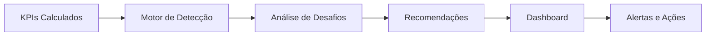

# 🚀 Visão e Arquitetura SuperRelatórios

## Visão Geral

SuperRelatórios é o GPS Estratégico para PMEs que transforma dados brutos em decisões inteligentes através de inteligência artificial e analytics avançados, democratizando acesso a ferramentas de nível corporativo.

## Contexto e Missão

### 🎯 Problema que Resolvemos

**85% das PMEs falham por falta de visão estratégica.** A maioria dos pequenos e médios negócios:

- **Coletam dados** mas não sabem interpretá-los
- **Têm intuição** mas falta estrutura analítica
- **Tomam decisões** com base em informações limitadas
- **Perdem oportunidades** por falta de insights rápidos
- **Não detectam problemas** até que seja tarde demais

### 💡 Nossa Solução

Criamos uma plataforma que **automatiza a inteligência estratégica**:

- **Coleta automática** de dados de múltiplas fontes
- **Análise em tempo real** com IA avançada
- **Detecção proativa** de desafios e oportunidades
- **Recomendações acionáveis** baseadas em best practices
- **Dashboard unificado** com métricas essenciais

### 🌍 Impacto Transformador

Transformamos PMEs de **reativas para proativas**, de **intuitivas para data-driven**, de **isoladas para conectadas**.

## Arquitetura de Produto

### 🏗️ Arquitetura Geral

#### Visão de Alto Nível

```
┌─────────────────────────────────────────────────────────────┐
│                    Frontend Layer                           │
├─────────────────────────────────────────────────────────────┤
│  React + TypeScript + Tailwind CSS + Vite                  │
│  ┌─────────────┐ ┌─────────────┐ ┌─────────────┐           │
│  │   Dashboard │ │   Reports   │ │   Settings  │           │
│  └─────────────┘ └─────────────┘ └─────────────┘           │
└─────────────────────────────────────────────────────────────┘
                              │
┌─────────────────────────────────────────────────────────────┐
│                    API Layer                                 │
├─────────────────────────────────────────────────────────────┤
│  RESTful API + GraphQL + Webhooks + Rate Limiting          │
│  ┌─────────────┐ ┌─────────────┐ ┌─────────────┐           │
│  │   Auth       │ │   Metrics   │ │   Strategy  │           │
│  └─────────────┘ └─────────────┘ └─────────────┘           │
└─────────────────────────────────────────────────────────────┘
                              │
┌─────────────────────────────────────────────────────────────┐
│                Business Logic Layer                          │
├─────────────────────────────────────────────────────────────┤
│  Domain-Driven Design + Clean Architecture                  │
│  ┌─────────────┐ ┌─────────────┐ ┌─────────────┐           │
│  │   Services  │ │   Entities  │ │   Repositories│           │
│  └─────────────┘ └─────────────┘ └─────────────┘           │
└─────────────────────────────────────────────────────────────┘
                              │
┌─────────────────────────────────────────────────────────────┐
│                  Data Layer                                  │
├─────────────────────────────────────────────────────────────┤
│  Supabase (PostgreSQL) + Redis + File Storage              │
│  ┌─────────────┐ ┌─────────────┐ ┌─────────────┐           │
│  │   Database  │ │    Cache    │ │   Storage   │           │
│  └─────────────┘ └─────────────┘ └─────────────┘           │
└─────────────────────────────────────────────────────────────┘
```

### 🎯 Pilares Arquiteturais

#### 1. Domain-Driven Design (DDD)

**Separação clara de responsabilidades baseada no domínio de negócio:**

```typescript
// Domain Layer - Coração do Negócio
src/domain/
├── unified/           # Métricas unificadas
├── metrics/           # KPIs e value objects
├── strategy/          # Templates estratégicos
├── organization/      # Hierarquia organizacional
└── shared/           # Tipos compartilhados

// Application Layer - Lógica de Aplicação
src/application/
├── services/          # Serviços de aplicação
├── use-cases/         # Casos de uso
├── dto/              # Data Transfer Objects
└── interfaces/       # Interfaces externas

// Infrastructure Layer - Implementação Técnica
src/infrastructure/
├── repositories/      # Persistência de dados
├── external/         # APIs externas
├── messaging/        # Eventos e filas
└── config/          # Configurações
```

#### 2. Clean Architecture

**Dependências apontam para dentro, garantindo independência:**

```
┌─────────────────────────────────────────┐
│            UI/Presentation Layer          │  ← React Components
├─────────────────────────────────────────┤
│         Application Layer                │  ← Use Cases, DTOs
├─────────────────────────────────────────┤
│            Domain Layer                  │  ← Business Logic
├─────────────────────────────────────────┤
│         Infrastructure Layer             │  ← Database, APIs
└─────────────────────────────────────────┘
```

#### 3. Microservices Pattern

**Serviços especializados com responsabilidades claras:**

```typescript
// Serviço de Métricas
interface MetricsService {
  getUnifiedMetrics(filter: MetricsFilter): Promise<UnifiedMetrics>;
  calculateKPI(kpiCode: string, data: RawData): Promise<KPIValue>;
  validateThreshold(kpi: KPIValue): Promise<ThresholdStatus>;
}

// Serviço Estratégico
interface StrategyService {
  detectChallenges(metrics: UnifiedMetrics): Promise<Challenge[]>;
  generateRecommendations(challenge: Challenge): Promise<Recommendation[]>;
  applyTemplate(templateId: string, context: Context): Promise<ActionPlan>;
}

// Serviço Organizacional
interface OrganizationService {
  getHierarchy(orgId: string): Promise<OrganizationHierarchy>;
  calculateOrgMetrics(orgId: string): Promise<OrganizationMetrics>;
  updateUserPermissions(
    userId: string,
    permissions: Permission[],
  ): Promise<void>;
}
```

## Stack Tecnológico

### 🎨 Frontend Stack

#### Core Technologies

- **React 18** - Biblioteca principal de UI
- **TypeScript 5.0** - Type safety e melhor DX
- **Vite 5** - Build tool rápido e moderno
- **Tailwind CSS 3** - Utility-first CSS framework

#### UI Components

- **shadcn/ui** - Componentes acessíveis e customizáveis
- **Radix UI** - Primitives de UI acessíveis
- **Lucide React** - Ícones consistentes e modernos
- **Recharts** - Biblioteca de gráficos e visualizações

#### State Management

- **TanStack Query** - Server state management
- **Zustand** - Client state management
- **React Hook Form** - Form management com validação

### ⚙️ Backend Stack

#### Database & Storage

- **Supabase** - Backend-as-a-Service (PostgreSQL + Auth + Storage)
- **PostgreSQL 15** - Banco de dados relacional
- **Redis** - Cache e session storage
- **Supabase Storage** - File storage para uploads

#### API & Integration

- **RESTful API** - Endpoints principais
- **GraphQL** - Queries flexíveis (futuro)
- **Webhooks** - Eventos em tempo real
- **Rate Limiting** - Proteção contra abuso

#### Authentication & Security

- **Supabase Auth** - Autenticação completa
- **JWT Tokens** - Session management
- **Row Level Security** - Segurança a nível de banco

#### 4. Security First (BFF/Proxy)

**Arquitetura de proteção para IAs e segredos:**

- **AI Proxy Layer**: Toda comunicação com LLMs é mediada por Edge Functions.
- **Secret Masking**: Chaves de API nunca tocam o navegador do usuário.
- **Edge Validation**: Rate limiting e validação de origem direto na borda (Edge).
- **Hardenened Headers**: CSP e HSTS rigorosos via infraestrutura.

### 🚀 DevOps & Infrastructure

#### Hosting & Deployment

- **Vercel** - Frontend hosting com CDN global
- **Supabase** - Backend hosting gerenciado
- **GitHub Actions** - CI/CD automatizado
- **Vercel Analytics** - Performance monitoring

#### Development Tools

- **ESLint + Prettier** - Code quality
- **Husky** - Git hooks
- **TypeScript Compiler** - Type checking
- **Playwright** - E2E testing

## Fluxo de Dados

### 📊 Pipeline de Dados

#### 1. Ingestão de Dados


**Fontes Suportadas:**

- **Planilhas** (Excel, Google Sheets, CSV)
- **ERPs** (SAP, Oracle NetSuite, Totvs)
- **CRMs** (Salesforce, HubSpot, Pipedrive)
- **Sistemas Financeiros** (QuickBooks, Xero)
- **APIs Custom** (REST, GraphQL, SOAP)

#### 2. Processamento e Enriquecimento


**Etapas do Processamento:**

- **Validação:** Qualidade e consistência dos dados
- **Enriquecimento:** Adição de contexto e metadados
- **Cálculo:** Aplicação de fórmulas de KPIs
- **Análise:** Detecção de tendências e anomalias
- **Geração:** Criação de insights acionáveis

#### 3. Análise e Inteligência



**Componentes de Inteligência:**

- **Motor de Detecção:** Identificação automática de desafios
- **Análise Preditiva:** Tendências e projeções
- **Benchmarking:** Comparação com mercado
- **Recomendações:** Sugestões baseadas em best practices

## Componentes Principais

### 📊 Unified Metrics System

#### Arquitetura de Métricas

```typescript
// Entidade Central
interface UnifiedMetricsEntity {
  id: string;
  domain: DomainType;
  period: string;
  kpis: Record<string, KPIValue>;
  metadata?: {
    source?: string;
    lastUpdated?: string;
    confidence?: number;
  };
}

// Value Objects
interface KPIValue {
  value: number;
  unit: string;
  threshold: Threshold;
  trend: "up" | "down" | "stable";
  previousValue?: number;
  change?: number;
  lastUpdated?: Date;
  confidence?: number;
}

// Thresholds
interface Threshold {
  readonly critical: number;
  readonly warning: number;
  readonly good: number;
}
```

#### Domínios de Métricas

- **Financial:** Receita, lucro, margem, caixa
- **Marketing:** CAC, LTV, churn, conversão
- **Sales:** Ciclo de vendas, pipeline, conversão
- **Operational:** Produtividade, eficiência, qualidade

### 🎯 Strategy Engine

#### Sistema de Detecção

```typescript
interface ChallengeDetection {
  id: string;
  challengeCode: string;
  severity: "critical" | "warning" | "info";
  confidence: number;
  detectedKPIs: string[];
  symptoms: string[];
  recommendations: Recommendation[];
}

interface Recommendation {
  id: string;
  title: string;
  description: string;
  priority: number;
  estimatedImpact: string;
  actionSteps: ActionStep[];
  resources: string[];
}
```

#### Biblioteca Estratégica

- **13 KPIs Essenciais** para PMEs
- **3 Desafios Principais** detectáveis
- **3 Objetivos Estratégicos** claros
- **15+ Templates** de ação

### 🏢 Organization Management

#### Hierarquia Organizacional

```typescript
interface OrganizationHierarchy {
  id: string;
  name: string;
  type: "company" | "department" | "team" | "unit";
  parent?: string;
  children?: OrganizationHierarchy[];
  metadata: {
    employeeCount?: number;
    budget?: number;
    manager?: string;
  };
}
```

#### Gestão de Usuários

- **Role-based access control** (RBAC)
- **Permissões granulares** por recurso
- **Hierarquia de acesso** baseada na organização
- **Audit trail** completo de atividades

## Experiência do Usuário

### 📱 Design Principles

#### 1. Mobile-First

- **Design responsivo** para todos os dispositivos
- **Touch-optimized** interações
- **Performance** otimizada para mobile
- **Progressive Web App** capabilities

#### 2. Data-Driven Interface

- **Visualizations** claras e intuitivas
- **Real-time updates** de métricas
- **Interactive filters** e drill-downs
- **Contextual help** e tooltips

#### 3. Action-Oriented Design

- **Clear CTAs** para ações principais
- **Workflow guidance** passo a passo
- **Quick actions** para tarefas comuns
- **Progressive disclosure** de complexidade

### 🎨 User Journey

#### Onboarding

1. **Cadastro inicial** - 2 minutos
2. **Conexão de dados** - 5 minutos
3. **Configuração inicial** - 3 minutos
4. **Primeiro dashboard** - Instantâneo

#### Daily Usage

1. **Login rápido** - Single sign-on
2. **Dashboard overview** - Visão 360°
3. **Alert review** - Prioridades do dia
4. **Deep dive** - Análises detalhadas

#### Advanced Features

1. **Custom reports** - Build your own
2. **Strategic planning** - Templates e frameworks
3. **Team collaboration** - Compartilhamento
4. **API integration** - Conecte seus sistemas

## Performance e Escalabilidade

### ⚡ Performance Metrics

#### Frontend Performance

- **First Contentful Paint:** < 1.8s
- **Largest Contentful Paint:** < 2.5s
- **Time to Interactive:** < 3.0s
- **Cumulative Layout Shift:** < 0.1

#### Backend Performance

- **API Response Time:** < 200ms (95th percentile)
- **Database Query Time:** < 100ms
- **Cache Hit Ratio:** > 85%
- **Uptime:** > 99.9%

### 📈 Escalabilidade

#### Horizontal Scaling

- **Auto-scaling** de frontend (Vercel)
- **Connection pooling** de database
- **Redis cluster** para cache distribuído
- **CDN global** para assets estáticos

#### Vertical Scaling

- **Database optimization** com indexes
- **Query optimization** e caching
- **Memory management** eficiente
- **Resource monitoring** contínuo

## Segurança e Compliance

### 🔒 Security Measures

#### Data Protection

- **Encryption at rest** e in transit
- **PII anonymization** para analytics
- **Data retention policies** configuráveis
- **Right to be forgotten** implementado

#### Access Control

- **Multi-factor authentication** (MFA)
- **Role-based permissions** granulares
- **Session management** seguro
- **API rate limiting** por usuário

### ⚖️ Compliance Framework

#### Regulations Supported

- **GDPR** (Europa) - Privacy by design
- **LGPD** (Brasil) - Lei de proteção de dados
- **CCPA** (Califórnia) - Consumer privacy
- **SOX** (Financeiro) - Compliance contábil

#### Certifications

- **ISO 27001** - Information Security Management
- **SOC 2 Type II** - Security controls
- **PCI DSS** - Payment card industry
- **HIPAA** - Healthcare data (future)

## Roadmap Estratégico

### 🚀 Short Term (0-6 meses)

#### Product Features

- **Advanced analytics** com machine learning
- **Mobile apps** nativos (iOS/Android)
- **Advanced reporting** com customização
- **Team collaboration** features

#### Technical Improvements

- **GraphQL API** para queries flexíveis
- **Real-time updates** com WebSockets
- **Advanced caching** strategies
- **Performance optimization** contínua

### 🎯 Medium Term (6-18 meses)

#### Platform Expansion

- **Industry-specific** templates
- **Advanced ML models** preditivos
- **Multi-tenant architecture**
- **Global marketplace** de integrações

#### Business Growth

- **Enterprise plans** com features avançadas
- **Partner ecosystem** program
- **Professional services** offerings
- **International expansion** planejada

### 🌟 Long Term (18+ meses)

#### Visionary Features

- **AI-powered insights** personalizados
- **Predictive analytics** avançados
- **Autonomous decision** making
- **Ecosystem integration** completa

#### Market Leadership

- **Category leadership** em analytics para PMEs
- **Global presence** em 50+ países
- **Industry recognition** e prêmios
- **IPO preparation** e crescimento sustentável

## Considerações Importantes

### 🔄 Evolução Contínua

#### Processo de Melhoria

1. **User feedback** contínuo e sistemático
2. **Data-driven decisions** para roadmap
3. **A/B testing** de novas features
4. **Performance monitoring** constante

#### Adaptabilidade

- **Market changes** e novas necessidades
- **Technology evolution** e modernização
- **User expectations** crescentes
- **Competitive landscape** dinâmico

### 🌍 Impacto Social

#### Democratização do Acesso

- **Small businesses** com ferramentas enterprise
- **Developing markets** com acesso a analytics
- **Financial inclusion** através de dados
- **Economic empowerment** de PMEs

#### Sustentabilidade

- **Paperless operations** - redução de impacto
- **Remote-friendly** - suporte a trabalho remoto
- **Energy efficiency** - infra otimizada
- **Social responsibility** - impacto positivo

---

## Recursos Relacionados

### 📚 Documentação Complementar

- **[Sistema de Design](./02-design-system.md)** - Diretrizes visuais e UI
- **[Fundação Estratégica](./03-strategic-foundation.md)** - Bibliotecas estratégicas
- **[Roadmap de Implementação](./04-implementation-roadmap.md)** - Cronogramo e progresso
- **[Arquitetura de Software](../02-technical/01-software-architecture.md)** - Detalhes técnicos

### 🔗 Recursos Externos

- **Product Demo** - Demonstração interativa
- **API Documentation** - Referência completa
- **Case Studies** - Histórias de sucesso
- **Community Forum** - Discussões e suporte

---

_Última atualização: 22/03/2026_  
_Versão: 2.0_  
_Status: Approved_  
_Maintainer: Product Team SuperRelatórios_
