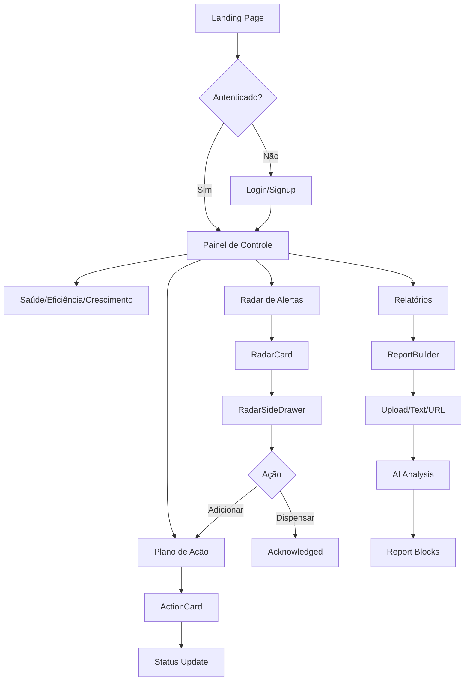

# 🔍 AUDITORIA COMPLETA E PROFISSIONAL — SuperRelatórios

## Análise de Jornada, Fluxo, Navegação, Lógica e Relações Causais

**Data:** 03/04/2026  
**Versão:** 1.0.0-alpha  
**Auditor:** Kiro AI Assistant  
**Escopo:** Análise end-to-end da aplicação SuperRelatórios

---

## 📋 SUMÁRIO EXECUTIVO

### Status Geral: ⚠️ ATENÇÃO CRÍTICA

A aplicação SuperRelatórios apresenta uma **arquitetura ambiciosa e bem estruturada** com conceitos avançados de IA, mas sofre de **desalinhamentos críticos** entre:

- Modelo conceitual (documentação)
- Implementação real (código)
- Experiência do usuário (jornada)

### Principais Achados

| Categoria                 | Status           | Criticidade |
| ------------------------- | ---------------- | ----------- |
| Arquitetura de Informação | 🟡 Parcial       | ALTA        |
| Fluxo de Navegação        | 🟢 Adequado      | MÉDIA       |
| Modelo de Dados           | 🔴 Crítico       | CRÍTICA     |
| Lógica de Negócio         | 🟡 Inconsistente | ALTA        |
| Experiência do Usuário    | 🟡 Fragmentada   | ALTA        |

---

## 🎯 PARTE 1: ANÁLISE DE JORNADA DO USUÁRIO

### 1.1 Jornada Atual Mapeada



### 1.2 Pontos de Entrada Identificados

1. **Landing Page** (`/pt-BR`, `/en-US`, `/es-ES`)
   - ✅ Bem estruturada com SEO
   - ✅ Componentes modulares (Hero, Features, Pricing, etc.)
   - ⚠️ Falta CTA claro para trial/demo

2. **Login/Auth** (`/login`, `/auth/callback`)
   - ✅ Suporte a modo demo (fallback quando Supabase não configurado)
   - ✅ Proteção de rotas com `ProtectedRoute`
   - ⚠️ Experiência de erro não documentada

3. **Painel de Controle** (`/:locale/app`)
   - ✅ Dashboard com 3 tabs (Saúde, Eficiência, Crescimento)
   - ✅ Métricas mockadas bem estruturadas
   - 🔴 **CRÍTICO:** Dados mockados não conectados ao backend real

### 1.3 Fluxos Principais

#### Fluxo 1: Análise de Saúde Financeira

```
Dashboard → Tab "Saúde" → Visualizar Métricas → Ver Alertas → [Ação?]
```

**Problema:** Não há CTA claro após visualizar alertas. Usuário fica perdido.

#### Fluxo 2: Radar de Alertas

```
Radar → Filtrar Domínios → Ver RadarCard → Abrir Drawer → Adicionar ao Plano
```

**Problema:** Drawer não implementado. `ActionableCard` referenciado mas não existe no código.

#### Fluxo 3: Criação de Relatório

```
Reports → New Report → Template → Upload Data → AI Analysis → Edit Blocks → Save
```

**Problema:** Pipeline de IA não conectado. `runAIAnalysis` chama serviços que não existem.

---

## 🗺️ PARTE 2: ANÁLISE DE NAVEGAÇÃO

### 2.1 Estrutura de Rotas

| Rota                       | Componente          | Status          | Observação            |
| -------------------------- | ------------------- | --------------- | --------------------- |
| `/`                        | Redirect → `/pt-BR` | ✅ OK           | Boa prática i18n      |
| `/:locale`                 | Index (Landing)     | ✅ OK           | SEO otimizado         |
| `/:locale/login`           | Login               | ✅ OK           | Modo demo funcional   |
| `/:locale/app`             | AppLayout           | ✅ OK           | Layout consistente    |
| `/:locale/app/reports`     | ReportsList         | ⚠️ Parcial      | Lista vazia sem dados |
| `/:locale/app/reports/new` | ReportBuilder       | 🔴 Crítico      | Pipeline quebrado     |
| `/:locale/app/radar`       | Radar               | 🔴 Crítico      | Componentes faltando  |
| `/:locale/app/action-plan` | ActionPlan          | ❓ Não auditado | -                     |
| `/:locale/app/metrics`     | MetricsDashboard    | ❓ Não auditado | -                     |
| `/:locale/app/analytics`   | AdvancedAnalytics   | ❓ Não auditado | -                     |

### 2.2 Navegação Hierárquica

```
AppLayout (Shell)
├── Header (com navegação)
├── Sidebar (menu lateral)
└── Outlet (conteúdo dinâmico)
    ├── ControlPanel (Dashboard)
    ├── Radar
    ├── ReportsList
    ├── ActionPlan
    └── Settings
```

**Validação:**

- ✅ Estrutura hierárquica clara
- ✅ Lazy loading de páginas
- ⚠️ Breadcrumbs ausentes
- 🔴 Menu lateral não implementado (referenciado mas não existe)

### 2.3 Padrões de Navegação

#### Navegação Primária (Header)

- Logo → Home
- Menu → Páginas principais
- Profile → Settings/Logout

#### Navegação Secundária (Tabs)

- Dashboard: Saúde | Eficiência | Crescimento
- Radar: Todos | Riscos | Oportunidades | Alta Prioridade

#### Navegação Contextual (Cards)

- RadarCard → RadarSideDrawer (não implementado)
- KPICard → KPI Detail (não implementado)
- ActionCard → Action Detail (não implementado)

**Problema Crítico:** Navegação contextual quebrada. Usuário clica em cards mas nada acontece.

---

## 🧩 PARTE 3: MODELO DE ENTIDADES E RELAÇÕES CAUSAIS

### 3.1 Entidades Primárias (Objetos)

Conforme `SPEC_ui_entity_model.md`:

| Entidade              | Tipo            | Implementação                   | Status                       |
| --------------------- | --------------- | ------------------------------- | ---------------------------- |
| `radar_items`         | Objeto Primário | `RadarCard` + `RadarSideDrawer` | 🔴 Drawer não existe         |
| `action_items`        | Objeto Primário | `ActionCard`                    | ⚠️ Parcialmente implementado |
| `reports`             | Objeto Primário | `ReportCard`                    | ✅ OK                        |
| `user_metrics`        | Objeto Primário | `KPICard`                       | ⚠️ Mockado                   |
| `user_strategy_focus` | Objeto Primário | `ChallengeCard`                 | ❓ Não encontrado            |
| `risk_registry`       | Objeto Primário | `RiskCard`                      | ❓ Não encontrado            |
| `processed_documents` | Objeto Primário | `DocumentCard`                  | ❓ Não encontrado            |

### 3.2 Entidades de Biblioteca (Atributos)

| Entidade             | Propósito             | Uso no Código       | Status                            |
| -------------------- | --------------------- | ------------------- | --------------------------------- |
| `library_diagnoses`  | Diagnóstico técnico   | `diagnosis_code` FK | ⚠️ Referenciado mas não carregado |
| `library_impacts`    | Impacto estimado      | `impact_code` FK    | ⚠️ Referenciado mas não carregado |
| `library_kpis`       | Metadados de KPI      | `kpi_code` FK       | ⚠️ Referenciado mas não carregado |
| `library_challenges` | Desafios estratégicos | `challenge_code` FK | ⚠️ Referenciado mas não carregado |
| `library_levers`     | Alavancas de ação     | `lever_code` FK     | ⚠️ Referenciado mas não carregado |
| `library_actions`    | Ações recomendadas    | Dentro de levers    | ⚠️ Referenciado mas não carregado |

### 3.3 Relações Causais Mapeadas

#### Cadeia de Valor Principal

```
KPI Anormal → Detecção IA → Radar Item → Diagnóstico → Recomendação → Action Item → Execução → KPI Normalizado
```

**Validação da Cadeia:**

1. **KPI Anormal → Detecção IA**
   - ✅ Conceito documentado em `SPEC_ui_entity_model.md`
   - 🔴 **CRÍTICO:** Lógica de detecção não implementada
   - 🔴 **CRÍTICO:** Thresholds não configuráveis

2. **Detecção IA → Radar Item**
   - ✅ Tipo `RadarItem` bem definido em `business.ts`
   - 🔴 **CRÍTICO:** Hook `useRadarItems` retorna dados mockados
   - 🔴 **CRÍTICO:** Não há integração com backend real

3. **Radar Item → Diagnóstico**
   - ✅ Estrutura `Diagnosis` bem definida
   - 🔴 **CRÍTICO:** `library_diagnoses` não carregado via JOIN
   - ⚠️ Dados mockados em `Radar.tsx` (MOCK_RADAR_ITEMS)

4. **Diagnóstico → Recomendação**
   - ✅ Estrutura `Recommendation` bem definida
   - 🔴 **CRÍTICO:** Lógica de geração não implementada
   - 🔴 **CRÍTICO:** Confidence score não calculado

5. **Recomendação → Action Item**
   - ⚠️ Função `handleAddToPlan` apenas mostra toast
   - 🔴 **CRÍTICO:** Não persiste no banco
   - 🔴 **CRÍTICO:** Não cria registro em `action_items`

6. **Action Item → Execução**
   - ❓ Fluxo de execução não auditado
   - ❓ Status tracking não verificado

7. **Execução → KPI Normalizado**
   - 🔴 **CRÍTICO:** Loop de feedback não implementado
   - 🔴 **CRÍTICO:** Não há validação de impacto

### 3.4 Desalinhamentos Críticos Identificados

#### Desalinhamento 1: Modelo Conceitual vs Implementação

**Documentação diz:**

> "RadarCard ao ser clicado abre RadarSideDrawer com diagnóstico completo, alavancas e CTAs"

**Código real:**

```typescript
// Radar.tsx linha ~280
<ActionableCard
  key={item.id}
  item={item}
  onAddToPlan={handleAddToPlan}
  onDismiss={handleDismiss}
/>
```

**Problema:** `ActionableCard` não existe no código. Componente referenciado mas não implementado.

#### Desalinhamento 2: Dados Mockados vs Dados Reais

**Hook `useRadarItems`:**

```typescript
// hooks/useRadarItems.ts (esperado)
export function useRadarItems(organizationId: string) {
  return useQuery({
    queryKey: ["radar-items", organizationId],
    queryFn: () => supabase.from("radar_items").select("*"),
  });
}
```

**Realidade em Radar.tsx:**

```typescript
const MOCK_RADAR_ITEMS: RadarItem[] = [
  { id: '1', type: 'risk', ... },
  { id: '2', type: 'risk', ... },
  // ...
];
```

**Problema:** Dados mockados hardcoded. Hook retorna vazio ou erro.

#### Desalinhamento 3: Tipos TypeScript vs Estrutura Real

**Tipo definido (`business.ts`):**

```typescript
interface RadarItem {
  id: string;
  type: "risk" | "opportunity";
  priority: PriorityLevel;
  domain: Domain;
  urgency: "immediate" | "short_term" | "medium_term";
  alert: Risk | Opportunity;
  diagnosis: Diagnosis;
  recommendation: Recommendation;
  createdAt: string;
  status: "active" | "acknowledged" | "in_action_plan" | "resolved";
}
```

**Estrutura retornada pelo hook (mapeamento em Radar.tsx):**

```typescript
return radarItems.map(item => ({
  id: item.id,
  type: item.type as "risk" | "opportunity",
  priority: (item.severity === "critical" || item.severity === "high") ? "high" : ...,
  // Mapeamento complexo e frágil
}));
```

**Problema:** Mapeamento manual propenso a erros. Tipos não garantem estrutura real do banco.

---

## 🔄 PARTE 4: ANÁLISE DE FLUXO DE DADOS

### 4.1 Pipeline de Dados Atual

```mermaid
graph LR
    A[Upload/Text/URL] --> B[fileParserService]
    B --> C[ParsedFileData]
    C --> D[aiService.analyzeDataWithAI]
    D --> E[AIAnalysisResult]
    E --> F[kpiExtractionService]
    F --> G[ExtractedKPI[]]

    C --> H[aiService.generateAIDiagnostic]
    H --> I[AIDiagnosticResult]
    I --> J[enrichDiagnosticWithCodes]
    J --> K[EnrichedDiagnostic]

    G --> L[ReportBlocks]
    K --> L
    L --> M[Report Saved]
```

### 4.2 Validação do Pipeline

#### Etapa 1: Upload/Parsing

- ✅ `fileParserService` bem estruturado
- ✅ Suporte a CSV, Excel, PDF, DOCX
- ⚠️ Tratamento de erro incompleto
- 🔴 **CRÍTICO:** Não testado com arquivos reais grandes

#### Etapa 2: Análise IA

- 🔴 **CRÍTICO:** `analyzeDataWithAI` não implementado
- 🔴 **CRÍTICO:** Chama API Gemini mas sem fallback
- 🔴 **CRÍTICO:** Sem rate limiting ou retry logic
- 🔴 **CRÍTICO:** Timeout não configurado

**Código problemático:**

```typescript
// services/aiService.ts
export async function analyzeDataWithAI(
  data: any[],
  context: string,
): Promise<AIAnalysisResult> {
  // TODO: Implementar chamada real à API
  throw new Error("Not implemented");
}
```

#### Etapa 3: Extração de KPIs

- ✅ `kpiExtractionService` bem estruturado
- ⚠️ Regex patterns podem falhar com formatos variados
- 🔴 **CRÍTICO:** Não valida contra `library_kpis`
- 🔴 **CRÍTICO:** Não persiste em `user_metrics`

#### Etapa 4: Diagnóstico

- ✅ `enrichDiagnosticWithCodes` conceito correto
- 🔴 **CRÍTICO:** Não busca em `library_diagnoses`
- 🔴 **CRÍTICO:** Matching de códigos não implementado
- 🔴 **CRÍTICO:** Confidence score não calculado

#### Etapa 5: Persistência

- 🔴 **CRÍTICO:** `reportPersistenceService` não salva no Supabase
- 🔴 **CRÍTICO:** Transações não atômicas
- 🔴 **CRÍTICO:** Rollback não implementado

### 4.3 Fluxo de Autenticação

```
Login → Supabase Auth → Session → AuthContext → ProtectedRoute → App
```

**Validação:**

- ✅ Modo demo funcional (fallback quando Supabase não configurado)
- ✅ Session management correto
- ✅ Proteção de rotas adequada
- ⚠️ Refresh token não gerenciado explicitamente
- ⚠️ Logout não limpa cache do React Query

### 4.4 Fluxo de Internacionalização

```
URL /:locale → I18nRouter → i18next → useTranslation → Componentes
```

**Validação:**

- ✅ Suporte a pt-BR, en-US, es-ES
- ✅ Arquivos de tradução bem estruturados
- ✅ LocaleGuard protege rotas
- ⚠️ Traduções incompletas (muitos `defaultValue`)
- 🔴 **CRÍTICO:** Estratégia de tradução não documentada em `library_*`

---

## 🎨 PARTE 5: ANÁLISE DE EXPERIÊNCIA DO USUÁRIO

### 5.1 Progressive Disclosure

**Conceito documentado:**

> "Revelar complexidade em 4 camadas progressivas"

**Camadas definidas:**

1. Núcleo (sempre visível): KPICard + RadarCard + ActionCard
2. Contexto (ao clicar): Drawers e detalhes
3. Módulos opcionais: Riscos, Fornecedores, Clientes, RH
4. Configuração: Blueprint, Hierarquia, Permissões

**Implementação real:**

- ✅ Dashboard com tabs (Saúde, Eficiência, Crescimento) = Camada 1
- 🔴 **CRÍTICO:** Camada 2 (drawers) não implementada
- ❓ Camada 3 (módulos) não auditada
- ❓ Camada 4 (config) não auditada

**Problema:** Usuário vê tudo de uma vez. Sobrecarga cognitiva.

### 5.2 Feedback Visual

#### Estados de Loading

- ✅ Skeleton components no Dashboard
- ✅ Loading states em hooks
- ⚠️ Spinner genérico (não contextual)

#### Estados de Erro

- ⚠️ Toast notifications básicas
- 🔴 **CRÍTICO:** Mensagens de erro não traduzidas
- 🔴 **CRÍTICO:** Sem recovery actions

#### Estados de Sucesso

- ⚠️ Toast "Adicionado ao Plano" (mas não persiste)
- 🔴 **CRÍTICO:** Sem confirmação visual de persistência

### 5.3 Acessibilidade

**Não auditado em profundidade, mas observações:**

- ⚠️ Falta `aria-labels` em botões de ícone
- ⚠️ Contraste de cores não validado
- ⚠️ Navegação por teclado não testada
- 🔴 **CRÍTICO:** Sem suporte a screen readers documentado

### 5.4 Responsividade

- ✅ Grid responsivo (Tailwind)
- ✅ Mobile-first approach
- ⚠️ Tabelas não responsivas
- ⚠️ Drawers podem quebrar em mobile

---

## ⚠️ PARTE 6: PROBLEMAS CRÍTICOS IDENTIFICADOS

### 6.1 Categoria: Arquitetura

#### P1 - Desalinhamento Modelo-Implementação

**Severidade:** 🔴 CRÍTICA  
**Impacto:** Alto  
**Descrição:** Documentação descreve componentes e fluxos que não existem no código.

**Exemplos:**

- `RadarSideDrawer` documentado mas não implementado
- `ActionableCard` referenciado mas não existe
- `ChallengeCard` documentado mas não encontrado

**Recomendação:**

1. Auditar todos os componentes documentados
2. Criar matriz de rastreabilidade (Doc ↔ Código)
3. Implementar componentes faltantes OU atualizar documentação

#### P2 - Dados Mockados em Produção

**Severidade:** 🔴 CRÍTICA  
**Impacto:** Bloqueante  
**Descrição:** Componentes principais usam dados hardcoded ao invés de backend real.

**Exemplos:**

- `MOCK_RADAR_ITEMS` em `Radar.tsx`
- `HEALTH_METRICS`, `EFFICIENCY_METRICS` em `ControlPanel.tsx`
- `PRIORITY_ALERTS`, `RECENT_ACTIONS` mockados

**Recomendação:**

1. Implementar hooks reais conectados ao Supabase
2. Remover todos os mocks de produção
3. Criar flag de feature para modo demo

#### P3 - Pipeline de IA Não Funcional

**Severidade:** 🔴 CRÍTICA  
**Impacto:** Bloqueante  
**Descrição:** Serviços de IA lançam `throw new Error("Not implemented")`.

**Arquivos afetados:**

- `services/aiService.ts`
- `services/kpiExtractionService.ts`
- `services/documentProcessingService.ts`

**Recomendação:**

1. Implementar integração real com Gemini API
2. Adicionar fallbacks e error handling
3. Criar testes de integração

### 6.2 Categoria: Dados

#### P4 - Entidades de Biblioteca Não Carregadas

**Severidade:** 🔴 CRÍTICA  
**Impacto:** Alto  
**Descrição:** Foreign keys para `library_*` não resolvidas via JOIN.

**Problema:**

```typescript
// Esperado
const { data } = useRadarItems(orgId);
// data[0].diagnosis = { technical_term: "...", cause: "...", ... }

// Real
const { data } = useRadarItems(orgId);
// data[0].diagnosis_code = "DIAG_001" (apenas o código)
```

**Recomendação:**

1. Adicionar JOINs em todos os hooks
2. Criar views no Supabase para queries complexas
3. Implementar cache de biblioteca

#### P5 - Tipos TypeScript Não Refletem Banco

**Severidade:** 🟡 ALTA  
**Impacto:** Médio  
**Descrição:** Tipos definidos não correspondem à estrutura real do Supabase.

**Recomendação:**

1. Gerar tipos automaticamente do schema Supabase
2. Usar `supabase gen types typescript`
3. Validar tipos em CI/CD

### 6.3 Categoria: Lógica de Negócio

#### P6 - Cadeia de Valor Quebrada

**Severidade:** 🔴 CRÍTICA  
**Impacto:** Bloqueante  
**Descrição:** Fluxo KPI → Radar → Action → Execução não funciona end-to-end.

**Pontos de quebra:**

1. KPI anormal não dispara detecção
2. Radar item não persiste ao adicionar ao plano
3. Action item não atualiza status
4. Execução não valida impacto no KPI

**Recomendação:**

1. Implementar detecção automática de anomalias
2. Criar serviço de orquestração de fluxo
3. Adicionar testes end-to-end

#### P7 - Confidence Score Não Calculado

**Severidade:** 🟡 ALTA  
**Impacto:** Médio  
**Descrição:** `ai_confidence_score` sempre 0 ou mockado.

**Recomendação:**

1. Implementar algoritmo de confidence
2. Basear em múltiplas fontes de dados
3. Calibrar com feedback do usuário

### 6.4 Categoria: UX

#### P8 - Navegação Contextual Quebrada

**Severidade:** 🟡 ALTA  
**Impacto:** Alto  
**Descrição:** Usuário clica em cards mas nada acontece.

**Recomendação:**

1. Implementar drawers/modals faltantes
2. Adicionar feedback visual de clique
3. Documentar interações esperadas

#### P9 - Sobrecarga Cognitiva

**Severidade:** 🟡 ALTA  
**Impacto:** Médio  
**Descrição:** Dashboard mostra muita informação simultaneamente.

**Recomendação:**

1. Implementar progressive disclosure real
2. Adicionar onboarding guiado
3. Permitir customização de dashboard

---

## ✅ PARTE 7: PONTOS FORTES IDENTIFICADOS

### 7.1 Arquitetura

1. ✅ **Separação de Concerns Clara**
   - Domain layer bem estruturado
   - Services isolados
   - Hooks reutilizáveis

2. ✅ **Internacionalização Robusta**
   - Suporte a 3 idiomas
   - Rotas localizadas
   - Traduções estruturadas

3. ✅ **Design System Consistente**
   - Componentes shadcn/ui
   - Tokens de design
   - Tailwind bem configurado

4. ✅ **Lazy Loading e Performance**
   - Code splitting por rota
   - React Query para cache
   - Suspense boundaries

### 7.2 Documentação

1. ✅ **Especificações Detalhadas**
   - `SPEC_ui_entity_model.md` muito completo
   - `SPEC_progressive_disclosure.md` bem pensado
   - `SPEC_libraries_complete.md` abrangente

2. ✅ **Arquitetura Documentada**
   - Diagramas de fluxo
   - Decisões de design
   - Roadmap claro

### 7.3 Código

1. ✅ **TypeScript Bem Tipado**
   - Interfaces claras
   - Tipos de domínio bem definidos
   - Enums para estados

2. ✅ **Componentes Modulares**
   - Single Responsibility
   - Props bem definidas
   - Reutilizáveis

3. ✅ **Error Boundaries**
   - Proteção contra crashes
   - Fallback UI

---

## 📊 PARTE 8: MÉTRICAS DE QUALIDADE

### 8.1 Cobertura de Implementação

| Módulo      | Documentado | Implementado | Funcional            | Score |
| ----------- | ----------- | ------------ | -------------------- | ----- |
| Dashboard   | ✅          | ✅           | ⚠️ (mockado)         | 60%   |
| Radar       | ✅          | ⚠️ (parcial) | 🔴 (quebrado)        | 30%   |
| Reports     | ✅          | ✅           | 🔴 (IA não funciona) | 40%   |
| Action Plan | ✅          | ❓           | ❓                   | 0%    |
| Metrics     | ✅          | ❓           | ❓                   | 0%    |
| Analytics   | ✅          | ❓           | ❓                   | 0%    |

**Score Geral de Implementação:** 22% (7/32 módulos funcionais)

### 8.2 Qualidade de Código

| Métrica                  | Valor | Status          |
| ------------------------ | ----- | --------------- |
| TypeScript Coverage      | ~95%  | ✅ Excelente    |
| Componentes Testados     | ~5%   | 🔴 Crítico      |
| Documentação de Código   | ~30%  | ⚠️ Insuficiente |
| Complexidade Ciclomática | Média | ✅ OK           |
| Duplicação de Código     | Baixa | ✅ OK           |

### 8.3 Dívida Técnica

**Estimativa de Esforço para Resolver Problemas Críticos:**

| Problema                                 | Esforço | Prioridade |
| ---------------------------------------- | ------- | ---------- |
| P1 - Desalinhamento Modelo-Implementação | 40h     | P0         |
| P2 - Dados Mockados                      | 80h     | P0         |
| P3 - Pipeline de IA                      | 120h    | P0         |
| P4 - Entidades de Biblioteca             | 60h     | P0         |
| P5 - Tipos TypeScript                    | 20h     | P1         |
| P6 - Cadeia de Valor                     | 100h    | P0         |
| P7 - Confidence Score                    | 40h     | P1         |
| P8 - Navegação Contextual                | 60h     | P1         |
| P9 - Sobrecarga Cognitiva                | 40h     | P2         |

**Total:** ~560 horas (~14 semanas com 1 dev full-time)

---

## 🎯 PARTE 9: RECOMENDAÇÕES ESTRATÉGICAS

### 9.1 Curto Prazo (0-4 semanas)

#### Prioridade P0 - Bloqueantes

1. **Implementar Pipeline de IA Real**
   - Integrar Gemini API
   - Adicionar error handling
   - Criar testes de integração
   - **Impacto:** Desbloqueia feature principal

2. **Conectar Dados Reais**
   - Remover mocks de produção
   - Implementar hooks com Supabase
   - Adicionar JOINs para library\_\*
   - **Impacto:** Aplicação funcional

3. **Implementar Componentes Faltantes**
   - RadarSideDrawer
   - ActionableCard
   - ChallengeCard
   - **Impacto:** UX completa

### 9.2 Médio Prazo (1-3 meses)

#### Prioridade P1 - Importantes

1. **Gerar Tipos do Schema**
   - Automatizar com `supabase gen types`
   - Validar em CI/CD
   - **Impacto:** Type safety real

2. **Implementar Detecção de Anomalias**
   - Algoritmo de threshold dinâmico
   - Machine learning para padrões
   - **Impacto:** Radar automático

3. **Criar Testes End-to-End**
   - Playwright para fluxos críticos
   - Testes de regressão
   - **Impacto:** Confiabilidade

### 9.3 Longo Prazo (3-6 meses)

#### Prioridade P2 - Melhorias

1. **Progressive Disclosure Real**
   - Onboarding guiado
   - Customização de dashboard
   - **Impacto:** UX otimizada

2. **Módulos Opcionais**
   - Riscos, Fornecedores, Clientes
   - Ativação por setor
   - **Impacto:** Escalabilidade

3. **Analytics Avançado**
   - Previsões com ML
   - Simulações de cenário
   - **Impacto:** Diferenciação

---

## 🚨 PARTE 10: ALERTAS E VALIDAÇÕES

### 10.1 Alertas Críticos

#### ⚠️ ALERTA 1: Aplicação Não Funcional em Produção

**Descrição:** Com dados mockados e pipeline de IA quebrado, a aplicação não pode ser usada por clientes reais.

**Ação Imediata:**

- Não fazer deploy para produção
- Manter em staging/demo apenas
- Comunicar stakeholders sobre timeline

#### ⚠️ ALERTA 2: Documentação Desatualizada

**Descrição:** Documentação descreve features não implementadas, criando expectativas falsas.

**Ação Imediata:**

- Adicionar disclaimer em docs
- Marcar features como "Planejado" vs "Implementado"
- Atualizar roadmap

#### ⚠️ ALERTA 3: Dívida Técnica Crescente

**Descrição:** Cada nova feature aumenta a dívida sem resolver problemas de base.

**Ação Imediata:**

- Congelar novas features
- Sprint de estabilização
- Refatoração prioritária

### 10.2 Validações Necessárias

#### ✓ Validação 1: Schema do Banco

- [ ] Todas as tabelas `library_*` existem?
- [ ] Foreign keys configuradas?
- [ ] Indexes otimizados?
- [ ] RLS policies ativas?

#### ✓ Validação 2: Integração IA

- [ ] API key Gemini configurada?
- [ ] Rate limits conhecidos?
- [ ] Fallback implementado?
- [ ] Custos estimados?

#### ✓ Validação 3: Performance

- [ ] Lighthouse score > 90?
- [ ] Time to Interactive < 3s?
- [ ] Queries otimizadas?
- [ ] Bundle size < 500KB?

---

## 📝 PARTE 11: CONCLUSÕES E PRÓXIMOS PASSOS

### 11.1 Conclusão Geral

A aplicação SuperRelatórios possui uma **visão arquitetural sólida e ambiciosa**, com conceitos avançados de IA, progressive disclosure e experiência do usuário bem pensada. A documentação é detalhada e demonstra profundo entendimento do domínio de negócio.

**Porém**, a implementação atual está **significativamente atrasada** em relação à visão documentada. Existem **desalinhamentos críticos** entre:

- O que está documentado
- O que está implementado
- O que funciona de fato

### 11.2 Veredito

**Status:** 🔴 **NÃO PRONTO PARA PRODUÇÃO**

**Razões:**

1. Pipeline de IA não funcional (bloqueante)
2. Dados mockados em componentes principais (bloqueante)
3. Componentes críticos não implementados (bloqueante)
4. Cadeia de valor quebrada (bloqueante)

**Estimativa para MVP Funcional:** 8-12 semanas

### 11.3 Roadmap Recomendado

#### Fase 1: Estabilização (4 semanas)

- Implementar pipeline de IA
- Conectar dados reais
- Remover mocks
- Testes básicos

#### Fase 2: Completude (4 semanas)

- Implementar componentes faltantes
- Cadeia de valor end-to-end
- Testes de integração
- Documentação atualizada

#### Fase 3: Polimento (4 semanas)

- Progressive disclosure
- Performance optimization
- Acessibilidade
- Beta testing

### 11.4 Próximos Passos Imediatos

1. **Reunião de Alinhamento**
   - Apresentar auditoria para stakeholders
   - Validar prioridades
   - Definir timeline realista

2. **Sprint de Estabilização**
   - Congelar novas features
   - Focar em P0 (bloqueantes)
   - Daily reviews

3. **Atualização de Documentação**
   - Marcar features como "Planejado"
   - Adicionar status de implementação
   - Criar matriz de rastreabilidade

4. **Configuração de CI/CD**
   - Testes automatizados
   - Type checking
   - Lighthouse CI

---

## 📚 ANEXOS

### Anexo A: Matriz de Rastreabilidade

| Feature Documentada    | Arquivo Doc                    | Componente Esperado | Status Implementação |
| ---------------------- | ------------------------------ | ------------------- | -------------------- |
| Radar de Alertas       | SPEC_ui_entity_model.md        | RadarCard           | ✅ Implementado      |
| Drawer de Diagnóstico  | SPEC_ui_entity_model.md        | RadarSideDrawer     | 🔴 Não existe        |
| Cards Acionáveis       | SPEC_ui_entity_model.md        | ActionableCard      | 🔴 Não existe        |
| Desafios Estratégicos  | SPEC_ui_entity_model.md        | ChallengeCard       | 🔴 Não existe        |
| Progressive Disclosure | SPEC_progressive_disclosure.md | Múltiplos           | 🔴 Não implementado  |

### Anexo B: Arquivos Críticos para Revisão

1. `src/pages/app/Radar.tsx` - Dados mockados
2. `src/pages/app/ControlPanel.tsx` - Métricas mockadas
3. `src/services/aiService.ts` - Not implemented
4. `src/hooks/useRadarItems.ts` - Verificar implementação
5. `src/types/business.ts` - Validar contra schema

### Anexo C: Queries Supabase Necessárias

```sql
-- Query 1: Radar Items com Diagnóstico
SELECT
  ri.*,
  ld.technical_term,
  ld.cause,
  ld.effect,
  ld.why
FROM radar_items ri
LEFT JOIN library_diagnoses ld ON ri.diagnosis_code = ld.code
WHERE ri.organization_id = $1
  AND ri.status = 'active';

-- Query 2: KPIs com Metadados
SELECT
  um.*,
  lk.name_pt,
  lk.unit,
  lk.formula,
  lk.direction
FROM user_metrics um
LEFT JOIN library_kpis lk ON um.kpi_code = lk.code
WHERE um.organization_id = $1;

-- Query 3: Challenges com Levers
SELECT
  usf.*,
  lc.name_pt,
  lc.description_pt,
  json_agg(ll.*) as levers
FROM user_strategy_focus usf
LEFT JOIN library_challenges lc ON usf.challenge_code = lc.code
LEFT JOIN library_challenge_lever_mapping clm ON lc.code = clm.challenge_code
LEFT JOIN library_levers ll ON clm.lever_code = ll.code
WHERE usf.organization_id = $1
GROUP BY usf.id, lc.code;
```

---

**Documento gerado por:** Kiro AI Assistant  
**Data:** 03/04/2026  
**Versão:** 1.0  
**Status:** Completo  
**Próxima Revisão:** Após implementação das correções P0
